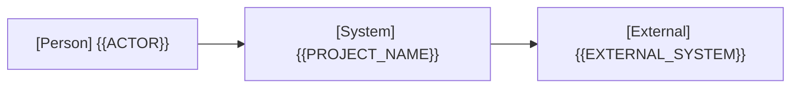

# アーキテクチャ

全体構造、共通方針、設計上の制約の正本です。具体的な処理は実現パターンの設計、保存形式は [データ設計](design/data.md)、仕様は [ユースケース一覧](project.md#usecases) から参照します。

## 1. システムコンテキスト

外部の人物・システムと本システムの関係を1枚で示します（Person には主アクター名を指定）。

## 2. コンテナ

| コンテナ | 技術 | 責務 | リポジトリ内パス |
| --- | --- | --- | --- |
| {{CONTAINER}} | {{TECH}} | {{RESPONSIBILITY}} | {{PATH}} |

全体の依存方向、状態の所有者と永続化の共通方針を記し、関係線ごとにモック切り替え境界（合成点）の有無を記載します。単一コンテナ構成の場合は図を省略し、1文の記述で代替可能です。

## 3. 実現パターン

| 実現パターンの設計 | 適用条件・関与コンテナ |
| --- | --- |
| [UCP-1](design/UCP-1.md) | {{APPLICABILITY}} |

## 4. 設計上の制約

{{ARCHITECTURAL_CONSTRAINTS}}

現在の設計が満たすべき制約と適用範囲を記述します。第1〜3節で表せる構成や責務は各節へ集約します。外部仕様に依存する場合は [確認した事実](project.md#design) を参照します。
