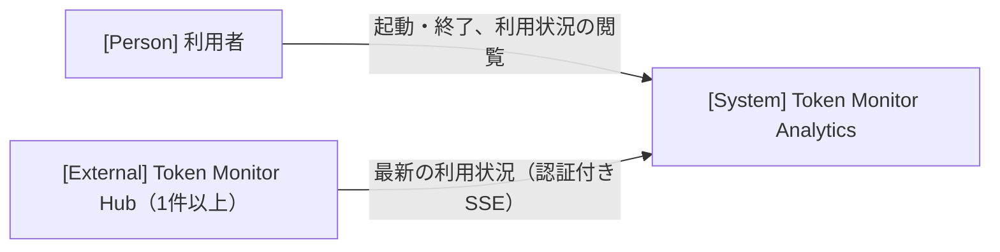

# アーキテクチャ

全体構造、共通方針、設計上の制約の正本です。具体的な処理は実現パターンの設計、保存形式は [データ設計](design/data.md)、仕様は [ユースケース一覧](project.md#usecases) から参照します。

## 1. システムコンテキスト

## 2. コンテナ

| コンテナ | 技術 | 責務 | リポジトリ内パス |
| --- | --- | --- | --- |
| ブラウザー画面 | React・TypeScript・Vite | 保存済みの利用状況を表示し、変更通知を受けたら取得し直して表示を更新する | frontend/ |
| アプリケーションサーバー | ASP.NET Core（.NET 10） | Hubからの受信と保存、保存確定の通知、画面とAPIの配信 | backend/ |
| ローカルDB | SQLite | Hubと最新状態の正本 | `.env` の `DB_PATH` |

受信・保存・配信は単一の .NET プロセスで行い、SQLite を保存済み状態の正本とします。画面は DB を直接参照せず、アプリケーションサーバーを経由します。保存確定の通知はプロセス内で受け渡し、画面へは変更の合図だけを送ります。同期側は画面の表示内容を知らず、画面は合図を受けて閲覧用APIから取得し直します（[UCP-3](design/UCP-3.md)）。Hub とアプリケーションサーバーの間にモックの合成点は置かず、検証時は接続設定の URL を制御可能な SSE サーバーへ向けます。画面とアプリケーションサーバーの間にも常設のモックは置かず、閲覧の検証は同じ方法で DB に状態を作って行います（[UCP-2](design/UCP-2.md)）。

## 3. 実現パターン

| 実現パターンの設計 | 適用条件・関与コンテナ |
| --- | --- |
| [UCP-1](design/UCP-1.md) | Hubから受信した最新状態をDBへ反映する。アプリケーションサーバー、ローカルDB、外部のHub |
| [UCP-2](design/UCP-2.md) | 保存済みのドメインモデルを読み取り専用で集計し、閲覧用APIで画面へ渡す。ブラウザー画面、アプリケーションサーバー、ローカルDB |
| [UCP-3](design/UCP-3.md) | DBへの保存確定を合図だけで画面へ通知し、画面に閲覧用APIから取得し直させる。ブラウザー画面、アプリケーションサーバー |

## 4. 設計上の制約

- ループバックアドレスだけで待ち受け、利用者向けの認証は設けません。閲覧用のAPIを公開する時点で、Hostヘッダーをループバックの名前に限定します。
- Hubの URL と認証トークンは Git 管理外の接続設定ファイルだけに置き、DB・ログ・API応答に含めません。
- Hubごとに受信処理を独立させ、あるHubの停止を他のHubとWebサーバーへ波及させません。
- 受信履歴は蓄積せず、Hubごとの最新状態だけを保持します。Hubの通知形式は [確認した事実](project.md#design) に従います。
- 画面への変更通知は、保存の COMMIT 完了後にだけ、保存の種類を問わず発行します。ロールバックした保存では発行しません。
- 画面への変更通知には変更の合図だけを載せ、利用データ・Hub の URL・認証トークンを含めません。短時間に続いた合図は1回にまとめてよいものとします。
- 通知の配信や購読側の失敗で、保存を失敗扱いにせず、Hubの受信も止めません。
- 画面は通知の接続・再接続のたびに閲覧用APIから取得し直して現在値に追従します。通知の履歴は保持・再送しません。
- 通知配信APIは `/api` 配下に置き、閲覧用APIと同じくループバックの Host だけを受け付けます。
