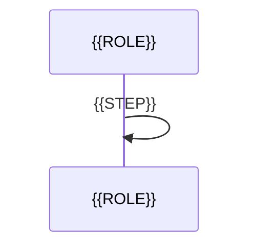

# UCP-1. {{PATTERN_NAME}}

適用条件と関与コンテナは [アーキテクチャの一覧](../architecture.md#patterns) を参照します。パターンからの逸脱は対象 UC ごとに本書へ記録します。図は主成功系列を役割名で示します。

| 役割 | 責務 | 実装パス（段階4完了時に記入） |
| --- | --- | --- |
| {{ROLE}} | {{ROLE_RESPONSIBILITY}} | |

- 整合性: 状態更新の主体 {{OWNER}} / 結果確定点 {{COMMIT_POINT}} / 障害時の停止・継続 {{FAILURE_BEHAVIOR}} / 境界（競合や通信断が想定される場合のみ） {{BOUNDARY}}
- モックに置き換える境界と合成点: {{MOCK_BOUNDARY}}
