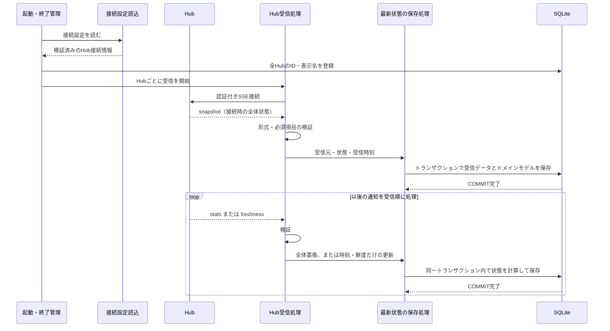

# UCP-1. Hubから受信した最新状態をDBへ反映する

適用条件と関与コンテナは [アーキテクチャの一覧](../architecture.md#patterns) を参照します。パターンからの逸脱は対象 UC ごとに本書へ記録します。図は主成功系列を役割名で示します。

| 役割 | 責務 | 実装パス（段階4完了時に記入） |
| --- | --- | --- |
| 起動・終了管理 | 接続設定とDBを準備し、全HubをDBへ登録してから受信を開始する。終了時は全Hubの受信を止め、処理中の保存が確定してからDBを閉じる | |
| 接続設定読込 | `.env` の `HUB_CONFIG_PATH` が指すJSONを検証し、Hubの接続情報を返す。ファイルは更新しない | |
| Hub受信処理 | Hubごとに1つ動く。`Authorization: Bearer`・`x-token-monitor-stream: 2` を付けて `/api/stats/stream` へ接続し、通知を解析・検証して、受信順に保存処理を呼ぶ | |
| 最新状態の保存処理 | 通知から次の状態を計算し、受信時刻と一括で保存する。同じトランザクションで受信データを本システムのドメインモデルへ変換して保存する | |

- 整合性: 状態更新の主体は最新状態の保存処理 / 結果確定点は COMMIT 完了 / 障害時の停止・継続は、認証失敗・HTTP応答の不正（リダイレクトを含む）・不正な通知・保存失敗・通信断のいずれでも当該Hubの受信だけを止め、最後に保存できた状態と他のHub・Webサーバーを維持する（保存失敗はロールバック） / 境界は、同じHubの通知を1件の保存完了後に次へ進めることと、各接続で最初の snapshot より前の差分通知を受け付けないこと。`freshness` の適用に必要な既存状態の読み取りは同じトランザクションで行い、heartbeat では保存しない。
- モックに置き換える境界と合成点: UI確認が不要なためモックは設けない。検証では外部のHubを制御可能な SSE サーバーに置き換え、接続設定の URL で切り替える。本番の受信・保存処理を通し、別のDB接続から保存値を照合する。
