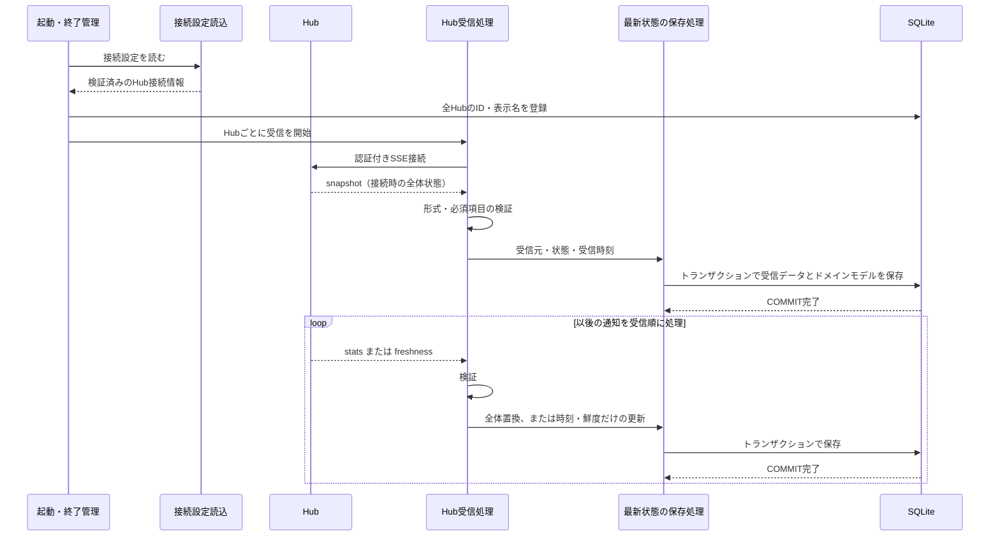

# UCP-1. Hubから受信した最新状態をDBへ反映する

適用条件と関与コンテナは [アーキテクチャの一覧](../architecture.md#patterns) を参照します。パターンからの逸脱は対象 UC ごとに本書へ記録します。図は主成功系列を役割名で示します。

| 役割 | 責務 | 実装パス（段階4完了時に記入） |
| --- | --- | --- |
| 起動・終了管理 | 接続設定とDBを準備し、全HubをDBへ受信中として登録し、設定から外れたHubをその行ごと削除してから受信を開始する。終了時は全Hubの受信を止め、処理中の保存が確定してからDBを閉じる | `backend/Hosting/AppHost.cs`、`backend/Features/HubSync/HubReceivers.cs` |
| 接続設定読込 | `.env` の `HUB_CONFIG_PATH` が指すJSONを検証し、Hubの接続情報を返す。ファイルは更新しない | `backend/Infrastructure/Configuration/HubConfigFile.cs` |
| Hub受信処理 | Hubごとに1つ動く。`Authorization: Bearer`・`x-token-monitor-stream: 2` を付けて `/api/stats/stream` へ接続し、通知を解析・検証して、受信順に保存処理を呼ぶ。保存の COMMIT 後に閲覧側へ変更を発行する（[UCP-3](UCP-3.md)）。受信が止まると受信状態を再接続中として記録して変更を発行し、待ち時間を1秒から倍にしながら（上限60秒）再接続する | `backend/Features/HubSync/HubReceivers.cs`、`backend/Features/HubSync/HubNotification.cs` |
| 最新状態の保存処理 | snapshot・stats は受信時刻と一括で保存し、同じトランザクションで受信データを本システムのドメインモデルへ変換して保存する（契約・利用枠は upsert し、利用枠の1つ目の計測点を取り直すときは、その時点の端末×モデル別コストも保存する）。freshness は保存済みの状態を読まずに、受信時刻とHub・端末の時刻・古さだけを更新する | `backend/Features/HubSync/HubStateStore.cs`、`backend/Infrastructure/Persistence/Migrations/001-hub-sync.sql` |
| 枠のコストの範囲の決定と推定（閲覧時に使う） | 枠のコストの範囲を決め、推定上限額を求める純粋関数（閲覧クエリが呼ぶ。[UCP-2](UCP-2.md)）。入力は、同じHub・同じ提供元の契約と枠（アカウント、ラベル、残量、1つ目の計測点の残量、取得元の端末）、現在の端末×モデル別コスト、各枠の1つ目の計測点の端末×モデル別コストで、出力は枠ごとの「金額」「推定中（Estimating）」「N/A（理由）」。DB・時刻・ログに触れない。保存処理にはルールを入れず、1つ目の計測点の事実（残量と端末×モデル別コスト）だけを保存する。基本ルールは [シナリオの「枠のコストの範囲」](../usecases/利用状況を閲覧する/scenarios/保存済みの最新利用状況を1画面で見る.md)、提供元ごとの個別ルールは下の表に定める。枠グループの導出は、画面（`frontend/src/limits.ts`）と同じ規則とし、同じケース表で両方を検証する。単体テストは、ケースを分けて十分に用意する（基本ルール、複数グループの名前一致と名前なし、一致なし、アカウント複数で端末が分かれる・共有する・不明、個別ルール、増分の下限と基準点にない組、境界）。 | （段階4完了時に記入） |

```mermaid
sequenceDiagram
  participant L as 起動・終了管理
  participant C as 接続設定読込
  participant H as Hub
  participant R as Hub受信処理
  participant S as 最新状態の保存処理
  participant D as SQLite
  L->>C: 接続設定を読む
  C-->>L: 検証済みのHub接続情報
  L->>D: 全HubのID・表示名を登録
  L->>R: Hubごとに受信を開始
  R->>H: 認証付きSSE接続
  H-->>R: snapshot（接続時の全体状態）
  R->>R: 形式・必須項目の検証
  R->>S: 受信元・状態・受信時刻
  S->>D: トランザクションで受信データとドメインモデルを保存
  D-->>S: COMMIT完了
  loop 以後の通知を受信順に処理
    H-->>R: stats または freshness
    R->>R: 検証
    R->>S: 全体置換、または時刻・鮮度だけの更新
    S->>D: トランザクションで保存
    D-->>S: COMMIT完了
  end
```

- 整合性: 状態更新の主体は最新状態の保存処理 / 結果確定点は COMMIT 完了 / 障害時の停止・継続は、認証失敗・HTTP応答の不正（リダイレクトを含む）・不正な通知・保存失敗・通信断のいずれでも当該Hubの接続だけを閉じ、最後に保存できた状態と他のHub・Webサーバーを維持して再接続する（保存失敗はロールバック）。受信状態は受信中から再接続中に変わったときだけ記録して変更を発行し、再接続後の最初の保存と同じトランザクションで受信中に戻す / 境界は、同じHubの通知を1件の保存完了後に次へ進めることと、各接続で最初の snapshot より前の差分通知を受け付けないこと。`freshness` では既存状態を読まずに時刻・古さの列だけを更新し、heartbeat では保存しない。
- モックに置き換える境界と合成点: UI確認が不要なためモックは設けない。検証では外部のHubを制御可能な SSE サーバーに置き換え、接続設定の URL で切り替える。本番の受信・保存処理を通し、別のDB接続から保存値を照合する。

### 枠のコストの範囲の個別ルール

提供元ごとの個別ルールは、基本ルールより優先します。個別ルールを持つ提供元は、アカウントが複数でも、グループが複数でも、グループごとに範囲を決めます（アカウントが複数のときの取得元の端末の規則は基本ルールと同じです）。

| 提供元 | 枠グループ | 数えるモデル |
| --- | --- | --- |
| cursor | `Cursor Models` | モデル名に `grok` または `composer` を含むもの（大文字小文字を区別しない） |
| cursor | `Other Models` | `Cursor Models` に数えないモデルすべて（`cursor-auto` を含む） |
| cursor | `Grok Bot` | 範囲を確定できない（N/A）。どのモデルも数えない |

