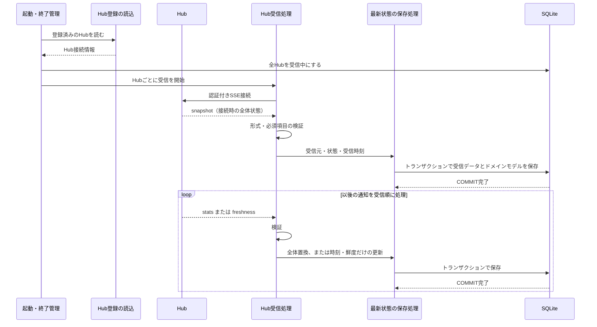

# UCP-1. Hubから受信した最新状態をDBへ反映する

適用条件と関与コンテナは [アーキテクチャの一覧](../architecture.md#patterns) を参照します。パターンからの逸脱は対象 UC ごとに本書へ記録します。図は主成功系列を役割名で示します。

| 役割 | 責務 | 実装パス |
| --- | --- | --- |
| 起動・終了管理 | DBを準備し、DBに登録済みの全Hubを受信中にし、同梱の価格一覧を価格表へ適用してから受信を開始する。終了時は全Hubの受信を止め、処理中の保存が確定してからDBを閉じる | `backend/Hosting/AppHost.cs`、`backend/Features/HubSync/HubReceivers.cs`、`backend/Features/LimitHistory/LimitHistoryStore.cs`、`backend/Features/LimitHistory/plan-prices.json` |
| Hub登録の読込 | DBに登録済みのHubの接続情報（ID・URL・認証トークン）を返す。登録は [UCP-4](UCP-4.md) が行う | 実装フェーズで記録 |
| Hub受信処理 | Hubごとに1つ動く。`Authorization: Bearer`・`x-token-monitor-stream: 2` を付けて `/api/stats/stream` へ接続し、通知を解析・検証して、受信順に保存処理を呼ぶ。保存の COMMIT 後に閲覧側へ変更を発行する（[UCP-3](UCP-3.md)）。受信が止まると受信状態を再接続中として記録して変更を発行し、待ち時間を1秒から倍にしながら（上限60秒）再接続する | `backend/Features/HubSync/HubReceivers.cs`、`backend/Features/HubSync/HubNotification.cs`、`backend/Features/HubSync/HubDeviceHistory.cs` |
| 最新状態の保存処理 | snapshot・stats は受信時刻と一括で保存し、同じトランザクションで受信データを本システムのドメインモデルへ変換して保存する（契約・利用枠は upsert し、利用枠の1つ目の計測点を取り直すときは、その時点の端末×モデル別コストも保存する）。日別の履歴を含むときは、日別の集計を日付ごとに上書きまたは追加する（含まない日付の行は消さない）。同じトランザクションで、製品ごとの月換算上限額と支払額を当日の行へ記録する。freshness は保存済みの状態を読まずに、受信時刻とHub・端末の時刻・古さだけを更新する | `backend/Features/HubSync/HubStateStore.cs`、`backend/Features/LimitHistory/LimitHistoryStore.cs`、`backend/Features/Overview/LimitWindowEstimates.cs`、`backend/Infrastructure/Persistence/Migrations/001-hub-sync.sql`、`backend/Infrastructure/Persistence/Migrations/004-daily-token-usages.sql`、`backend/Infrastructure/Persistence/Migrations/005-device-daily-model-usages.sql`、`backend/Infrastructure/Persistence/Migrations/006-limit-cost-baselines.sql`、`backend/Infrastructure/Persistence/Migrations/007-limit-history.sql` |
| 枠のコストの範囲の決定と推定（閲覧時と日次記録で使う） | 枠のコストの範囲を決め、推定上限額を求める純粋関数（閲覧クエリと月換算上限額の日次記録が呼ぶ。[UCP-2](UCP-2.md)）。入力は、同じHub・同じ提供元の契約と枠（アカウント、ラベル、残量、1つ目の計測点の残量、取得元の端末）、現在の端末×モデル別コスト、各枠の1つ目の計測点の端末×モデル別コストで、出力は枠ごとの「金額」「推定中（Estimating）」「N/A（理由）」。DB・時刻・ログに触れない。保存処理は計測点の扱いにルールを入れず、1つ目の計測点の事実（残量と端末×モデル別コスト）だけを保存する。基本ルールは [シナリオの「枠のコストの範囲」](../usecases/利用状況を閲覧する/scenarios/保存済みの最新利用状況を1画面で見る.md)、提供元ごとの個別ルールは下の表に定める。枠グループの導出は、画面（`frontend/src/limits.ts`）と同じ規則とし、同じケース表で両方を検証する。単体テストは、ケースを分けて十分に用意する（基本ルール、複数グループの名前一致と名前なし、一致なし、アカウント複数で端末が分かれる・共有する・不明、個別ルール、増分の下限と基準点にない組、境界）。 | `backend/Features/Overview/LimitEstimator.cs` |
| 月換算上限額の算出（日次記録で使う） | 枠グループの推定上限額のうち金額で長さが分かる枠を31日に比例換算し、最小値を返す純粋関数。約1か月（28〜31日）の枠はそのまま使う。枠の長さの補完と換算は画面（`frontend/src/limits.ts`）と同じ規則とする | `backend/Features/LimitHistory/MonthlyLimit.cs` |

```mermaid
sequenceDiagram
  participant L as 起動・終了管理
  participant C as Hub登録の読込
  participant H as Hub
  participant R as Hub受信処理
  participant S as 最新状態の保存処理
  participant D as SQLite
  L->>C: 登録済みのHubを読む
  C-->>L: Hub接続情報
  L->>D: 全Hubを受信中にする
  L->>R: Hubごとに受信を開始
  R->>H: 認証付きSSE接続
  H-->>R: snapshot（接続時の全体状態）
  R->>R: 形式・必須項目の検証
  R->>S: 受信元・状態・受信時刻
  S->>D: トランザクションで受信データとドメインモデルを保存
  D-->>S: COMMIT完了
  loop 以後の通知を受信順に処理
    H-->>R: stats または freshness
    R->>R: 検証
    R->>S: 全体置換、または時刻・鮮度だけの更新
    S->>D: トランザクションで保存
    D-->>S: COMMIT完了
  end
```

- 整合性: 状態更新の主体は最新状態の保存処理 / 結果確定点は COMMIT 完了 / 障害時の停止・継続は、認証失敗・HTTP応答の不正（リダイレクトを含む）・不正な通知・保存失敗・通信断のいずれでも当該Hubの接続だけを閉じ、最後に保存できた状態と他のHub・Webサーバーを維持して再接続する（保存失敗はロールバック）。受信状態は受信中から再接続中に変わったときだけ記録して変更を発行し、再接続後の最初の保存と同じトランザクションで受信中に戻す / 境界は、同じHubの通知を1件の保存完了後に次へ進めることと、各接続で最初の snapshot より前の差分通知を受け付けないこと。`freshness` では既存状態を読まずに時刻・古さの列だけを更新し、heartbeat では保存しない。
- モックに置き換える境界と合成点: UI確認が不要なためモックは設けない。検証では外部のHubを制御可能な SSE サーバーに置き換え、登録するHubの URL で切り替える。本番の受信・保存処理を通し、別のDB接続から保存値を照合する。

### 枠のコストの範囲の個別ルール

提供元ごとの個別ルールは、基本ルールより優先します。個別ルールを持つ提供元は、アカウントが複数でも、グループが複数でも、グループごとに範囲を決めます（アカウントが複数のときの取得元の端末の規則は基本ルールと同じです）。

| 提供元 | 枠グループ | 数えるモデル |
| --- | --- | --- |
| cursor | `Cursor Models` | モデル名に `grok` または `composer` を含むもの（大文字小文字を区別しない） |
| cursor | `Other Models` | `Cursor Models` に数えないモデルすべて（`cursor-auto` を含む） |
| cursor | `Grok Bot` | 範囲を確定できない（N/A）。どのモデルも数えない |

## Hub情報を表示する固有の処理

同期側のHub受信処理が、認証付き `GET /api/devices` で日次明細を取得する。取得の契機、当日値との置き換え、端末と日付単位の保存、トランザクションと失敗時の扱いは [保存と変換の規則](#保存と変換の規則) に従う。外部取得と検証は保存トランザクションを開始する前に完了し、statsと日次明細の保存をCOMMITした後にだけ [UCP-3](UCP-3.md) の変更通知を発行する。表示条件は [Hub情報を表示する](../usecases/Hub情報を表示する/README.md) に従う。

## 保存と変換の規則

- 起動時に、DBに登録済みの全Hubの `connected` を1にします。Hubの削除（[UCP-4](UCP-4.md)）では `hubs` の行を削除し、`hub_states`・`hub_summaries`・`devices`・`latest_token_usages`・`daily_token_usages`・`device_daily_model_usages`・`hub_accounts`・`daily_monthly_limits` の行は連鎖削除で消え、続けて `latest_limit_windows`・`limit_window_baseline_costs` の行も連鎖して消えます。続けて、どの `hub_accounts` からも参照されない `accounts` の行を削除します。
- 受信が止まったHubは `connected` を0にします。再接続後の保存で、受信データと同じトランザクションで1に戻します。起動直後の最初の接続中も1です。
- `snapshot` と `stats` は `hub_states` を全体置換し、同じトランザクションで当該Hubの `hub_summaries`・`latest_token_usages` を新しい stats から作り直し、`hub_accounts`・`latest_limit_windows` は新しい stats の内容で更新します（行は作り直さず upsert し、報告されなくなった行だけを削除します。基準点のコストを消さないためです）。`devices` は報告された端末を追加または更新し、報告から消えた端末だけを削除します。端末をすべて消してから作り直す処理は行わず、残った端末の日次明細を維持します。`accounts` は報告された行を登録し、ラベルを最新の値で更新します。
- 端末の日次モデル明細は同期側が `GET /api/devices` から取得します。`snapshot` 受信時はrevisionの報告有無にかかわらず取得し、`stats` では報告された `deviceHistoryRevision` が変わった場合だけ取得します。同じrevisionのstatsと `freshness` では再取得しません。revisionを報告しないstatsは日次明細を更新しません。取得を完了してから、通知のstatsと日次明細を同じトランザクションで保存します。取得・検証・保存の失敗時は以前の保存値を維持し、当該Hubだけを再接続します。閲覧側への通知はCOMMIT完了後だけ発行します。
- `device_daily_model_usages` は受け取った端末・日付の組だけモデル明細を置き換え、受け取っていない日付は維持します。当日の最新値は、端末が報告した `periodWindows.today.key` の日付があり、当日の期間が受信時刻で期限内かつ最新の当日トークン合計が同日の履歴合計以上の場合に、その端末・日付のモデル明細を置き換えます。revisionを報告するstatsでは、同じrevisionでも保存済み履歴のある端末にこの規則を適用し、当日の最新値と保存済みの当日トークン合計を比較します。この更新のために再取得・取得状態フラグ・履歴のキャッシュは設けません。最新値と履歴を加算しません。
- `freshness` は保存済みの行を読まず、同じトランザクションで `hub_states.received_at`、`hub_summaries.updated_at`、通知に含まれる端末の `devices.updated_at`・`stale` だけを更新します。`hub_states.stats_json` と日次明細を含むその他の利用量は変更しません。期間の区切りが変わるとHubは `stats` を送るため、期限切れの判定は `snapshot`・`stats` の保存時だけ行います。
- `latest_token_usages` は端末ごとの期間別 `clientModels`・`clientModelCosts` から作ります。Hub・ツール・モデル単位の合計はこのテーブルの合計で求めます（2026-09-12取得の実測資料で、期限切れの端末がない場合にHub集約の各合計と端末別・ツール×モデル別の合計が一致することを確認）。period は stats の `periods.today`・`month`・`allTime` に対応します。端末の `today`・`month` は、`periodWindows` の当該期間の `endsAt` が受信時刻以前なら期限切れとして行を作りません。`periodWindows` が無い端末は、端末の最終更新時刻と受信時刻のUTCの日付・月が異なる場合に期限切れとします（Hubが自身の集計から期限切れの端末分を除く規則と同じ）。
- `hub_accounts` は Hub集約の `limits.providers` のうち、メーターを表示する枠を1つ以上持つ契約から作ります。`source_device_id` は、その提供元の項目の `sourceDeviceId`（無ければNULL）をそのまま保存します。
- `latest_limit_windows` は Hub集約の `limits.providers` のうち、`showMeter` が真で `remainingPercent` が数値の枠から作ります。同じアカウントの同じ枠を複数のHubが報告した場合は Hub ごとに行を持ち、閲覧ではHubを選んで表示します。`window_minutes` は枠の `windowMinutes`（数値。無ければNULL）をそのまま保存します。`meter_changed_at` は更新前の行と残量が同じなら引き継ぎ、変わった場合と新規の場合は今回の受信時刻にします。
- `latest_limit_windows` の1つ目の計測点は、更新前の行があり、受信時刻が更新前の行の `resets_at` より前（`resets_at` が無ければ条件なし）で、残量が前回以下なら引き継ぎます。`resets_at` の値は受信のたびに変わりうるため、値の一致では判定しません。新規の枠、受信時刻が更新前の行の `resets_at` を過ぎた場合、残量が増えた（使用率が減った）場合は、今回の受信時刻・残量を1つ目の計測点にし、同じトランザクションで、その枠の `limit_window_baseline_costs` を消して、今回の `latest_token_usages` の累計（allTime）のうち、枠の提供元と同じツールで推定コストのある端末×モデルの行から作り直します。
- 閲覧では、枠のコストの範囲の決定と推定上限額を、上記の純粋関数で求めます。入力は、同じHub・同じ提供元の `hub_accounts`・`latest_limit_windows`、現在の `latest_token_usages`（allTime）と、各枠の `limit_window_baseline_costs` です。コストの増分は、範囲に入る端末×モデルごとの「現在のコスト − 1つ目の計測点のコスト」の合計で、組ごとの増分は0を下限とし、1つ目の計測点にない組は0として扱います。推定上限額は `コストの増分 ÷ (base_remaining_percent − remaining_percent) × 100` で、残量の差が1ポイント未満か、コストの増分が0以下なら「推定中」（Estimating）、範囲を確定できなければ「N/A」とします。
- `snapshot`・`stats` の保存では、ドメインモデルの更新と同じトランザクションで、当該Hubの枠の推定上限額を閲覧と同じ純粋関数で求め、契約×枠グループごとに月換算上限額を上記の純粋関数で求めます。求まった枠グループは、受信時刻の現地日付の `daily_monthly_limits` の行を upsert し、`plan` と、価格表から引いた `price_usd` を同じ行に書きます。求まらない枠グループの行は変えません。`freshness` では記録しません。
- 起動時に、Hubの登録の後、同梱の価格一覧を `plan_prices` へ適用します。行の無いプランは追加し、同梱の `updatedAt` が `updated_at` より新しいプランだけを上書きします。同梱の一覧に無いプランの行は消しません。
- Hubの URL と認証トークンは登録情報として `hubs` に保存し（[UCP-4](UCP-4.md)）、受信データ・ドメインモデルの他のテーブルへは複製しません。セッション、プロジェクト、月次履歴、トークンの内訳（キャッシュ・出力など）、アカウントのメールアドレス・氏名はドメインモデルに含めません（受信データには含まれます）。
- 外部キーと削除・更新時の動作は [テーブル設計](data.dbml) に従います。スキーマ版0から1への移行で初期テーブルを作成し、版1から2への移行で `latest_limit_windows` を作り直します（既存の行は移さず、次の `snapshot`・`stats` で作り直します）。版2から3への移行で `latest_limit_windows` に `window_minutes` を追加します（既存の行はNULLのままで、次の `snapshot`・`stats` で値が入ります）。版3から4への移行で `daily_token_usages` を追加します。版4から5への移行で `device_daily_model_usages` を追加し、既存データは保持します。新しいテーブルは空の状態から始まり、同期の取り込みで行を作ります。版5から6への移行で `latest_limit_windows` を作り直し（`base_cost_usd`・`cost_usd` を持たず、外部キーを `hub_accounts` に付け替える。既存の行は移さない）、`hub_accounts` と `limit_window_baseline_costs` を作成します。次の `snapshot`・`stats` で、契約・枠・1つ目の計測点が作られます。版6から7への移行で `plan_prices` と `daily_monthly_limits` を空の状態で作成し、既存データは保持します。版7から8への移行で、`hubs` に `url`・`token` を必須の列として追加します。既存のHubは接続情報を持たないため、その行と連鎖する保存データを削除します（[UCP-4](UCP-4.md)）。移行と版の更新は同一トランザクションで行います。
