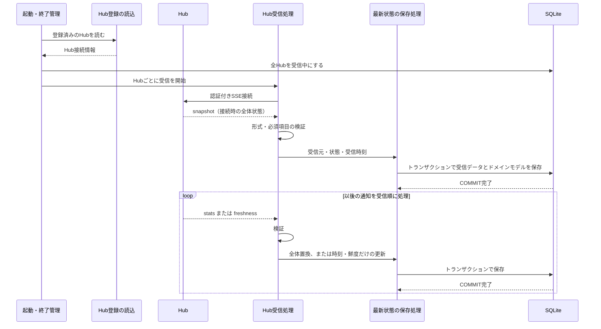

# UCP-1. Hubから受信した最新状態をDBへ反映する

適用条件と関与コンテナは [アーキテクチャの一覧](../architecture.md#patterns) を参照します。パターンからの逸脱は対象 UC ごとに本書へ記録します。図は主成功系列を役割名で示します。

| 役割 | 責務 | 実装パス |
| --- | --- | --- |
| 起動・終了管理 | DBを準備し、接続情報を持つ登録済みのHubを受信中にし、受信を開始する。終了時は全Hubの受信を止め、処理中の保存が確定してからDBを閉じる | `backend/Hosting/AppHost.cs`、`backend/Features/HubSync/HubReceivers.cs` |
| Hub登録の読込 | DBに登録済みのHubのうち接続情報を持つものの接続情報（ID・URL・認証トークン）を返し、起動時に受信状態を整える。登録は [UCP-4](UCP-4.md) が行う | `backend/Features/HubRegistration/HubRegistry.cs` |
| Hub受信処理 | Hubごとに1つ動く。`Authorization: Bearer`・`x-token-monitor-stream: 2` を付けて `/api/stats/stream` へ接続し、通知を解析・検証して、受信順に保存処理を呼ぶ。保存の COMMIT 後に閲覧側へ変更を発行する（[UCP-3](UCP-3.md)）。受信が止まると受信状態を再接続中として記録して変更を発行し、待ち時間を1秒から倍にしながら（上限60秒）再接続する | `backend/Features/HubSync/HubReceivers.cs`、`backend/Features/HubSync/HubNotification.cs`、`backend/Features/HubSync/HubDeviceHistory.cs` |
| 最新状態の保存処理 | snapshot・stats は受信時刻と一括で保存し、同じトランザクションで受信データを本システムのドメインモデルへ変換して保存する。契約・利用枠は upsert し、報告されなくなった枠は最後に記録した次のリセット時刻まで残す。日別の履歴を含むときは、日別の集計を日付ごとに上書きまたは追加する（含まない日付の行は消さない）。freshness は保存済みの状態を読まずに、受信時刻とHub・端末の時刻・古さだけを更新する | `backend/Features/HubSync/HubStateStore.cs`、`backend/Infrastructure/Persistence/Migrations/009-schema.sql` |

```mermaid
sequenceDiagram
  participant L as 起動・終了管理
  participant C as Hub登録の読込
  participant H as Hub
  participant R as Hub受信処理
  participant S as 最新状態の保存処理
  participant D as SQLite
  L->>C: 登録済みのHubを読む
  C-->>L: Hub接続情報
  L->>D: 全Hubを受信中にする
  L->>R: Hubごとに受信を開始
  R->>H: 認証付きSSE接続
  H-->>R: snapshot（接続時の全体状態）
  R->>R: 形式・必須項目の検証
  R->>S: 受信元・状態・受信時刻
  S->>D: トランザクションで受信データとドメインモデルを保存
  D-->>S: COMMIT完了
  loop 以後の通知を受信順に処理
    H-->>R: stats または freshness
    R->>R: 検証
    R->>S: 全体置換、または時刻・鮮度だけの更新
    S->>D: トランザクションで保存
    D-->>S: COMMIT完了
  end
```

- 整合性: 状態更新の主体は最新状態の保存処理 / 結果確定点は COMMIT 完了 / 障害時の停止・継続は、認証失敗・HTTP応答の不正（リダイレクトを含む）・不正な通知・保存失敗・通信断のいずれでも当該Hubの接続だけを閉じ、最後に保存できた状態と他のHub・Webサーバーを維持して再接続する（保存失敗はロールバック）。受信状態は受信中から再接続中に変わったときだけ記録して変更を発行し、再接続後の最初の保存と同じトランザクションで受信中に戻す / 境界は、同じHubの通知を1件の保存完了後に次へ進めることと、各接続で最初の snapshot より前の差分通知を受け付けないこと。`freshness` では既存状態を読まずに時刻・古さの列だけを更新し、heartbeat では保存しない。
- モックに置き換える境界と合成点: UI確認が不要なためモックは設けない。検証では外部のHubを制御可能な SSE サーバーに置き換え、登録するHubの URL で切り替える。本番の受信・保存処理を通し、別のDB接続から保存値を照合する。

## Hub情報を表示する固有の処理

同期側のHub受信処理が、認証付き `GET /api/devices` で日次明細を取得する。取得の契機、当日値との置き換え、端末と日付単位の保存、トランザクションと失敗時の扱いは [保存と変換の規則](#保存と変換の規則) に従う。外部取得と検証は保存トランザクションを開始する前に完了し、statsと日次明細の保存をCOMMITした後にだけ [UCP-3](UCP-3.md) の変更通知を発行する。表示条件は [Hub情報を表示する](../usecases/Hub情報を表示する/README.md) に従う。

## 保存と変換の規則

- 起動時に、DBに登録済みの全Hubの `connected` を1にします。Hubの削除（[UCP-4](UCP-4.md)）では `hubs` の行を削除し、`hub_states`・`hub_summaries`・`devices`・`latest_token_usages`・`daily_token_usages`・`device_daily_model_usages`・`hub_accounts` の行は連鎖削除で消え、続けて `latest_limit_windows` の行も連鎖して消えます。続けて、どの `hub_accounts` からも参照されない `accounts` の行を削除します。
- 受信が止まったHubは `connected` を0にします。再接続後の保存で、受信データと同じトランザクションで1に戻します。起動直後の最初の接続中も1です。
- `snapshot` と `stats` は `hub_states` を全体置換し、同じトランザクションで当該Hubの `hub_summaries`・`latest_token_usages` を新しい stats から作り直し、`hub_accounts`・`latest_limit_windows` は新しい stats の内容で更新します（行は作り直さず upsert します）。`latest_limit_windows` は、報告されなくなった行を、最後に記録した `resets_at` を過ぎるまで削除せず、最後に報告された値のまま残します。`hub_accounts` は、保持する枠の親となるため、報告されなくなった契約も削除しません（Hubの削除でだけ消えます）。`devices` は報告された端末を追加または更新し、報告から消えた端末だけを削除します。端末をすべて消してから作り直す処理は行わず、残った端末の日次明細を維持します。`accounts` は報告された行を登録し、ラベルを最新の値で更新します。
- 端末の日次モデル明細は同期側が `GET /api/devices` から取得します。`snapshot` 受信時はrevisionの報告有無にかかわらず取得し、`stats` では報告された `deviceHistoryRevision` が変わった場合だけ取得します。同じrevisionのstatsと `freshness` では再取得しません。revisionを報告しないstatsは日次明細を更新しません。取得を完了してから、通知のstatsと日次明細を同じトランザクションで保存します。取得・検証・保存の失敗時は以前の保存値を維持し、当該Hubだけを再接続します。閲覧側への通知はCOMMIT完了後だけ発行します。
- `device_daily_model_usages` は受け取った端末・日付の組だけモデル明細を置き換え、受け取っていない日付は維持します。当日の最新値は、端末が報告した `periodWindows.today.key` の日付があり、当日の期間が受信時刻で期限内かつ最新の当日トークン合計が同日の履歴合計以上の場合に、その端末・日付のモデル明細を置き換えます。revisionを報告するstatsでは、同じrevisionでも保存済み履歴のある端末にこの規則を適用し、当日の最新値と保存済みの当日トークン合計を比較します。この更新のために再取得・取得状態フラグ・履歴のキャッシュは設けません。最新値と履歴を加算しません。
- `freshness` は保存済みの行を読まず、同じトランザクションで `hub_states.received_at`、`hub_summaries.updated_at`、通知に含まれる端末の `devices.updated_at`・`stale` だけを更新します。`hub_states.stats_json` と日次明細を含むその他の利用量は変更しません。期間の区切りが変わるとHubは `stats` を送るため、期限切れの判定は `snapshot`・`stats` の保存時だけ行います。
- `latest_token_usages` は端末ごとの期間別 `clientModels`・`clientModelCosts` から作ります。Hub・ツール・モデル単位の合計はこのテーブルの合計で求めます（2026-09-12取得の実測資料で、期限切れの端末がない場合にHub集約の各合計と端末別・ツール×モデル別の合計が一致することを確認）。period は stats の `periods.today`・`month`・`allTime` に対応します。端末の `today`・`month` は、`periodWindows` の当該期間の `endsAt` が受信時刻以前なら期限切れとして行を作りません。`periodWindows` が無い端末は、端末の最終更新時刻と受信時刻のUTCの日付・月が異なる場合に期限切れとします（Hubが自身の集計から期限切れの端末分を除く規則と同じ）。
- `hub_accounts` は Hub集約の `limits.providers` のうち、メーターを表示する枠を1つ以上持つ契約から作ります。一度作った行は、契約が報告されなくなっても残し、再び報告されたときに上書きします。閲覧は利用枠の行がある契約だけを対象にするため、枠の行がすべて消えた契約の `hub_accounts` の行は、画面にもAPIにも現れません。
- `latest_limit_windows` は Hub集約の `limits.providers` のうち、`showMeter` が真で `remainingPercent` が数値の枠から作ります。同じアカウントの同じ枠を複数のHubが報告した場合は Hub ごとに行を持ち、閲覧ではHubを選んで表示します。`window_minutes` は枠の `windowMinutes`（数値。無ければNULL）をそのまま保存します。`meter_changed_at` は更新前の行と残量が同じなら引き継ぎ、変わった場合と新規の場合は今回の受信時刻にします。
- 報告されなくなった枠の行は、そのHubのsnapshot・statsを保存するたびに、受信時刻が行の `resets_at` を過ぎたものを削除します。`resets_at` が無い枠の行は、報告されなくなった保存で削除します。同じ契約の枠が1本でも報告されている間も、報告されない枠は同じ規則で保持します。保持している枠は、閲覧で報告された枠と同じように読みます（区別する列は設けません）。Hubの削除では、そのHubの枠もすべて消えます。
- Hubの URL と認証トークンは登録情報として `hubs` に保存し（[UCP-4](UCP-4.md)）、受信データ・ドメインモデルの他のテーブルへは複製しません。セッション、プロジェクト、月次履歴、トークンの内訳（キャッシュ・出力など）、アカウントのメールアドレス・氏名はドメインモデルに含めません（受信データには含まれます）。
- 外部キーと削除・更新時の動作は [テーブル設計](data.dbml) に従います。新規DBは `backend/Infrastructure/Persistence/Migrations/009-schema.sql` で版9のテーブルを直接作成します。既存の版8のDBは `backend/Infrastructure/Persistence/Migrations/009-remove-limit-estimates.sql` で上限金額専用の3テーブルと3列を削除し、その他の保存値を維持します。移行と版の更新は同一トランザクションで行い、失敗時は元のDBを維持します。版9のDBは変更せず、版1〜7と未知の版は受け付けません。
