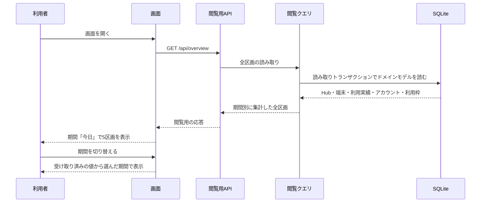

# UCP-2. 保存済みのドメインモデルを閲覧用APIで画面へ渡す

適用条件と関与コンテナは [アーキテクチャの一覧](../architecture.md#patterns) にあります。図は主成功系列を役割名で示し、UC 固有の逸脱は本書へ記録します。

| 役割 | 責務 | 実装パス（段階4完了時に記入） |
| --- | --- | --- |
| 画面 | 表示時に閲覧用APIを1回呼ぶ。期間の切り替えは受け取った期間別の値から選び、APIを呼び直さない | `frontend/src/routes/index.tsx`、`frontend/src/api/overview.ts` |
| 閲覧用API | `GET /api/overview` を提供し、全区画のデータを期間別にまとめて1回で返す。契約はOpenAPIから生成するTypeScriptの型で画面と共有する。Hostヘッダーをループバックの名前に限定する | `backend/Presentation/Http/ApiEndpoints.cs`、`backend/Presentation/Http/Contracts.cs`、`backend/Presentation/Http/HttpPresentationRegistration.cs` |
| 閲覧クエリ | ドメインモデルのテーブルだけを読み取り専用で読み、集計して返す。受信データ（`hub_states.stats_json`）は読まない | `backend/Features/Overview/OverviewQuery.cs`、`backend/Infrastructure/Persistence/Database.cs` |

- 整合性: 状態更新の主体はなし（本パターンは状態を更新しない） / 結果確定点は読み取りトランザクションの完了 / 障害時の停止・継続は、読み取り失敗時に当該リクエストだけを失敗させ、Hubの受信とWebサーバーを維持する / 境界は、1回の応答を1つの読み取りトランザクションから作り、区画の間で値が食い違わないこと。
- モックに置き換える境界と合成点: 動作合意では画面側で閲覧用APIを呼ぶ関数1箇所を合成点とし、合意後に固定データと切り替えを削除した。検証では Hub を制御可能な SSE サーバーに置き換えて本番の受信・保存処理で DB に状態を作り、閲覧用APIと画面から読む。
