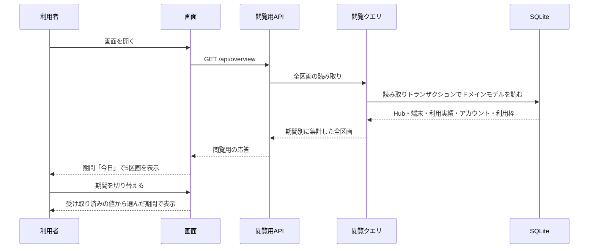

# UCP-2. 保存済みのドメインモデルを閲覧用APIで画面へ渡す

適用条件と関与コンテナは [アーキテクチャの一覧](../architecture.md#patterns) にあります。図は主成功系列を役割名で示し、UC 固有の逸脱は本書へ記録します。

| 役割 | 責務 | 実装パス（段階4完了時に記入） |
| --- | --- | --- |
| 画面 | 表示時に閲覧用APIを1回呼ぶ（表示中の取得し直しは [UCP-3](UCP-3.md)）。期間、利用枠のHub、Hub別のページは受け取った値から選び、APIを呼び直さない。Hub別は2件ずつ表示する。トークン数と推定コストは、表示する値が変わるたびに変わった桁をリールで回す。利用枠は、枠グループ・長さ・ラベル・残り時間・ペース・月換算上限額を受け取った値から表示上で計算し、1分ごとに再計算する。変更通知の購読は画面全体で1つにし、左のメニュー（Hub・契約・端末の項目）と各ページが同じ状態を読む | `frontend/src/routes/index.tsx`、`frontend/src/api/overview.ts`、`frontend/src/components/SlotNumber.tsx`、`frontend/src/components/LimitCircle.tsx`、`frontend/src/components/ActivityCalendar.tsx`、`frontend/src/components/providerIcons.ts`、`frontend/src/limits.ts`、`frontend/src/format.ts`、`frontend/src/app/overview.tsx`、`frontend/src/components/SideMenu.tsx` |
| 閲覧用API | `GET /api/overview` を提供し、全区画のデータを期間別にまとめて1回で返す。契約はOpenAPIから生成するTypeScriptの型で画面と共有する。Hostヘッダーをループバックの名前に限定する | `backend/Presentation/Http/ApiEndpoints.cs`、`backend/Presentation/Http/Contracts.cs`、`backend/Presentation/Http/HttpPresentationRegistration.cs` |
| 閲覧クエリ | ドメインモデルのテーブルだけを読み取り専用で読み、集計して返す。受信データ（`hub_states.stats_json`）は読まない | `backend/Features/Overview/OverviewQuery.cs`、`backend/Infrastructure/Persistence/Database.cs` |

```mermaid
sequenceDiagram
  participant U as 利用者
  participant P as 画面
  participant A as 閲覧用API
  participant Q as 閲覧クエリ
  participant D as SQLite
  U->>P: 画面を開く
  P->>A: GET /api/overview
  A->>Q: 全区画の読み取り
  Q->>D: 読み取りトランザクションでドメインモデルを読む
  D-->>Q: Hub・端末・利用実績・アカウント・利用枠
  Q-->>A: 期間別に集計した全区画
  A-->>P: 閲覧用の応答
  P-->>U: 期間「今日」で5区画を表示
  U->>P: 期間を切り替える
  P-->>U: 受け取り済みの値から選んだ期間で表示
```

- 整合性: 状態更新の主体はなし（本パターンは状態を更新しない） / 結果確定点は読み取りトランザクションの完了 / 障害時の停止・継続は、読み取り失敗時に当該リクエストだけを失敗させ、Hubの受信とWebサーバーを維持する / 境界は、1回の応答を1つの読み取りトランザクションから作り、区画の間で値が食い違わないこと。
- モックに置き換える境界と合成点: 動作合意では画面側で閲覧用APIを呼ぶ関数1箇所を合成点とし、合意後に固定データと切り替えを削除した。検証では Hub を制御可能な SSE サーバーに置き換えて本番の受信・保存処理で DB に状態を作り、閲覧用APIと画面から読む。

## Hub情報を表示する固有の処理

画面は閲覧用APIから、保存済みのHub情報とモデル・デバイス別の日次明細を取得し、選択した期間と集約単位で表示する。閲覧クエリはローカルDBのドメインモデルだけを読み、Hubへ接続しない。日次明細の未取得とコストの不明を区別する。画面の表示・操作は [Hub情報を表示する](../usecases/Hub情報を表示する/README.md) に従う。

| 役割 | 責務 | 実装パス |
| --- | --- | --- |
| Hub利用状況の取得 | `fetchHubUsage` を唯一の取得境界とし、`HubUsageData` と日次明細の型を画面と固定データで共有する。実処理では `GET /api/hub-usage` を呼ぶ。API接続は段階4で実装する | `frontend/src/api/hub-usage.ts` |
| 表示集計 | 受け取った日次明細を選択期間・日次／週次／月次で集計し、トークン合計による上位5モデルとOther、デバイス別合計と構成比を返す。集約単位を変えても期間合計を変えない | `frontend/src/hub-usage.ts` |

モックの合成点は `fetchHubUsage` 1箇所とする。`import.meta.env.DEV` が真かつ `VITE_HUB_USAGE_MOCK` が `1` の場合だけ同関数の固定データを返す。それ以外は閲覧用APIを呼び、通信失敗時にも固定データへ切り替えない。固定データの起動・終了と無効化の確認は [実行手順](../project.md#commands) に従う。
