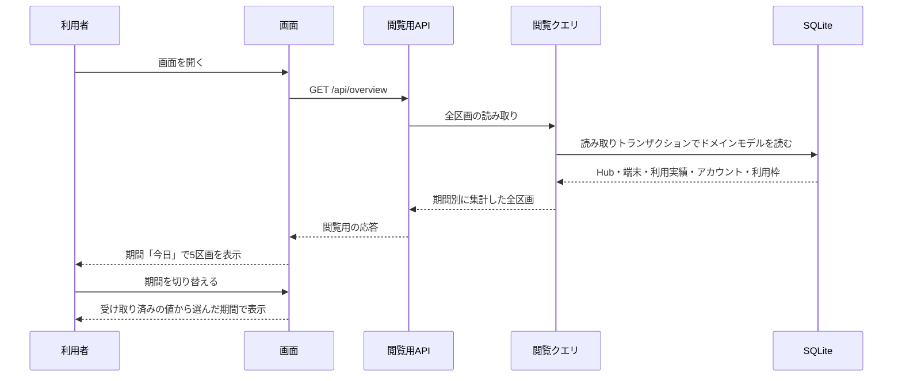

# UCP-2. 保存済みのドメインモデルを閲覧用APIで画面へ渡す

適用条件と関与コンテナは [アーキテクチャの一覧](../architecture.md#patterns) にあります。図は主成功系列を役割名で示し、UC 固有の逸脱は本書へ記録します。

## 共通の処理

HomeとHub情報の閲覧画面に共通して適用する。画面上部と区画内のトークン数・推定コストの数値表示には、`TokenCount`・`CostUsd` が共用する既存の `SlotNumber` と共通の数値書式を使用し、表示する値が変わるたびに変わった桁をリールで回す。グラフの軸・ツールチップ・構成比はリール表示の対象外とする。トークン数は整数のカンマ区切り、推定コストはUSDの小数2桁とする。不明値は「—」とし、ゼロに置き換えない。

画面の表示時に閲覧用APIを1回呼ぶ。期間・Hub・集約単位・ページの切り替えは受け取った値から選び、APIを呼び直さない。変更通知の購読は画面全体で1つにし、左のメニューと各ページが同じ通知接続を共用する。表示中の取得し直しは [UCP-3](UCP-3.md) に従う。

| 役割 | 責務 | 実装パス |
| --- | --- | --- |
| 数値表示 | トークン数と推定コストの共通書式・リール更新 | `frontend/src/components/SlotNumber.tsx`、`frontend/src/format.ts` |
| 通知購読 | 画面全体で変更通知を共用する | `frontend/src/api/overview.ts`、`frontend/src/app/overview.tsx`、`frontend/src/components/SideMenu.tsx` |

## 利用状況を閲覧する固有の処理

以下の区画構成・利用枠・Hub別ページングはHomeに適用する。Hub情報の閲覧画面には適用しない。

| 役割 | 責務 | 実装パス（段階4完了時に記入） |
| --- | --- | --- |
| 画面 | Hub別は2件ずつ表示する。利用枠は、枠グループ・長さ・ラベル・残り時間・ペース・月換算上限額を受け取った値から表示上で計算し、1分ごとに再計算する | `frontend/src/routes/index.tsx`、`frontend/src/components/LimitCircle.tsx`、`frontend/src/components/ActivityCalendar.tsx`、`frontend/src/components/providerIcons.ts`、`frontend/src/limits.ts` |
| 閲覧用API | `GET /api/overview` を提供し、全区画のデータを期間別にまとめて1回で返す。契約はOpenAPIから生成するTypeScriptの型で画面と共有する。Hostヘッダーをループバックの名前に限定する | `backend/Presentation/Http/ApiEndpoints.cs`、`backend/Presentation/Http/Contracts.cs`、`backend/Presentation/Http/HttpPresentationRegistration.cs` |
| 閲覧クエリ | ドメインモデルのテーブルだけを読み取り専用で読み、集計して返す。受信データ（`hub_states.stats_json`）は読まない | `backend/Features/Overview/OverviewQuery.cs`、`backend/Infrastructure/Persistence/Database.cs` |

```mermaid
sequenceDiagram
  participant U as 利用者
  participant P as 画面
  participant A as 閲覧用API
  participant Q as 閲覧クエリ
  participant D as SQLite
  U->>P: 画面を開く
  P->>A: GET /api/overview
  A->>Q: 全区画の読み取り
  Q->>D: 読み取りトランザクションでドメインモデルを読む
  D-->>Q: Hub・端末・利用実績・アカウント・利用枠
  Q-->>A: 期間別に集計した全区画
  A-->>P: 閲覧用の応答
  P-->>U: 期間「今日」で5区画を表示
  U->>P: 期間を切り替える
  P-->>U: 受け取り済みの値から選んだ期間で表示
```

- 整合性: 状態更新の主体はなし（本パターンは状態を更新しない） / 結果確定点は読み取りトランザクションの完了 / 障害時の停止・継続は、読み取り失敗時に当該リクエストだけを失敗させ、Hubの受信とWebサーバーを維持する / 境界は、1回の応答を1つの読み取りトランザクションから作り、区画の間で値が食い違わないこと。
- モックに置き換える境界と合成点: 動作合意では画面側で閲覧用APIを呼ぶ関数1箇所を合成点とし、合意後に固定データと切り替えを削除した。検証では Hub を制御可能な SSE サーバーに置き換えて本番の受信・保存処理で DB に状態を作り、閲覧用APIと画面から読む。

## Hub情報を表示する固有の処理

画面の表示・操作は [Hub情報を表示する](../usecases/Hub情報を表示する/README.md) に従う。

| 役割 | 責務 | 実装パス |
| --- | --- | --- |
| Hub利用状況の取得 | `fetchHubUsage` を唯一の取得境界とし、`GET /api/hub-usage` を呼ぶ。契約はOpenAPIから生成するTypeScriptの型で画面と共有する | `frontend/src/api/hub-usage.ts`、`backend/Presentation/Http/Contracts.cs`、`backend/Presentation/Http/ApiEndpoints.cs` |
| Hub利用状況の閲覧クエリ | 読み取り専用のトランザクションでHubと端末、日次モデル明細のドメインモデルを読む。`hub_states.stats_json` は読まず、Hubへ接続しない。日次明細の取得可否を示す独立フラグは返さない | `backend/Features/HubUsage/HubUsageQuery.cs` |
| 表示集計 | 受け取った日次明細を選択期間・日次／週次／月次で集計し、トークン合計による上位5モデルとOther、デバイス別合計と構成比を返す。集約単位を変えても期間合計を変えない。選択期間に明細が無いときは未取得値をゼロにしない | `frontend/src/hub-usage.ts` |

固定データと環境変数による切り替えは設けず、通信失敗時にも固定データへ切り替えない。変更の購読は既存の画面全体で1つの通知接続を共用し、新たなEventSourceを作らない（[UCP-3](UCP-3.md)）。保存確定後は同じ取得境界を呼び直し、鮮度更新では受信時刻と端末の鮮度だけを表示中の状態へ反映する。
