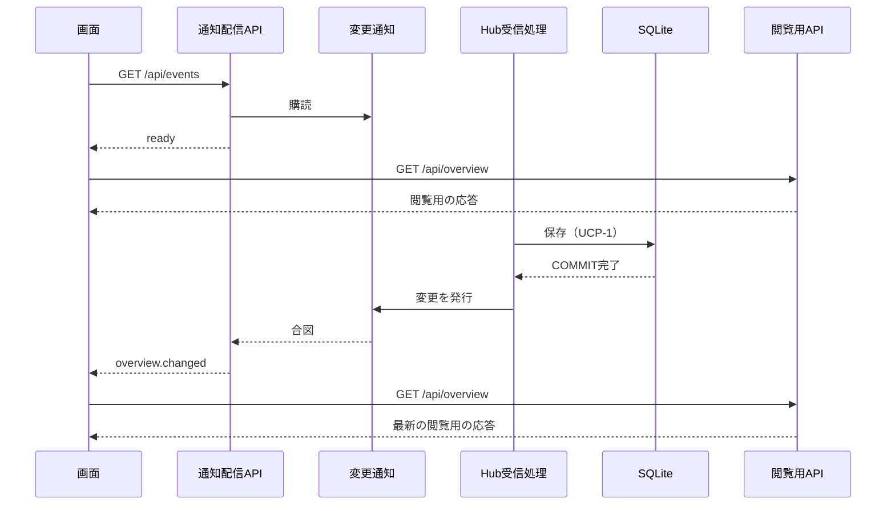

# UCP-3. DBへの保存確定を画面へ通知し、取得し直させる

適用条件と関与コンテナは [アーキテクチャの一覧](../architecture.md#patterns) を参照します。図は主成功系列を役割名で示し、UC 固有の逸脱は本書へ記録します。保存までは [UCP-1](UCP-1.md)、取得し直す処理は [UCP-2](UCP-2.md) の閲覧用APIをそのまま使います。

| 役割 | 責務 | 実装パス（段階4完了時に記入） |
| --- | --- | --- |
| Hub受信処理 | 保存の COMMIT 完了後に、保存の種類を問わず変更を発行する。画面の表示内容は参照しない |  |
| 変更通知 | プロセス内で購読者を保持し、発行時に全購読者へ合図する。購読者の失敗は記録するだけで、発行元へ伝えない。利用者は1人のため購読者を区別しない |  |
| 通知配信API | `GET /api/events` を SSE で提供する。接続時に `ready`、変更の発行を受けたら `overview.changed` を送る。未送信の合図は1回にまとめる。Hostヘッダーをループバックの名前に限定する |  |
| 画面 | 表示中は通知配信APIへ接続し、`ready` と `overview.changed` を受けるたびに閲覧用APIを呼び直す |  |

- 整合性: 状態更新の主体はなし（本パターンは状態を更新しない） / 結果確定点は、通知の前提が保存の COMMIT 完了、画面の表示が取得し直した読み取りトランザクションの完了 / 障害時の停止・継続は、配信の失敗で当該接続だけを終え、保存とHubの受信を維持する。切れた接続はブラウザーの再接続に任せ、再接続時の `ready` で取得し直す / 境界は、COMMIT 前に発行しないことと、合図に利用データを載せないこと。
- モックに置き換える境界と合成点: 動作合意では画面側の通知購読の関数1箇所を合成点とし、任意の時点で合図を発生させる。検証では Hub を制御可能な SSE サーバーに置き換えて本番の受信・保存処理から通知を発生させ、画面の表示が更新されることを確認する。
