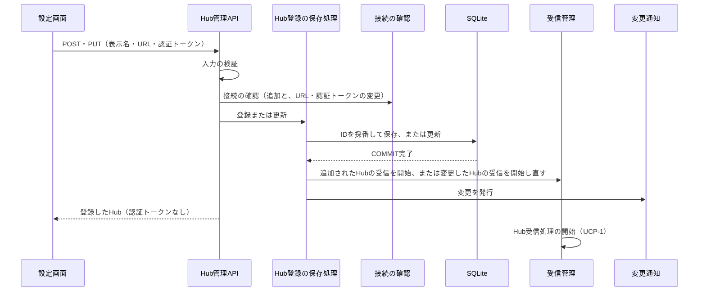

# UCP-4. 画面から登録・変更したHubをDBへ保存し、受信へ反映する

適用条件と関与コンテナは [アーキテクチャの一覧](../architecture.md#patterns) を参照します。図は主成功系列を役割名で示し、UC 固有の逸脱は本書へ記録します。受信と保存は [UCP-1](UCP-1.md)、保存確定の通知と取得し直しは [UCP-3](UCP-3.md) をそのまま使います。

| 役割 | 責務 | 実装パス |
| --- | --- | --- |
| 設定画面 | `/settings` で登録済みHubの一覧を表示し、追加と変更のポップアップで入力を受ける（変更は現在の表示名・URLを入れ、Tokenは空から始める）。保存を押したときに入力を検証し、該当した項目のそばにメッセージを示す。一覧は変更の通知（[UCP-3](UCP-3.md)）を受けるたびに取り直し、認証トークンは送信後に画面へ戻さない | `frontend/src/routes/settings.tsx`、`frontend/src/api/hubs.ts`、`frontend/src/hub-form.ts` |
| Hub管理API | `GET /api/hubs`（一覧）、`POST /api/hubs`（追加）、`PUT /api/hubs/{hubId}`（変更）を受け付ける。Hostヘッダーをループバックの名前に限定する。入力を設定画面と同じ規則で再検証し、追加と、URLまたは認証トークンが変わる変更では、保存の前に接続の確認を行う。不正な入力と接続の確認の失敗は、保存せず400で項目ごとの理由を返す。変更でTokenが空なら登録済みの認証トークンを使い、存在しないHubは404を返す。応答に認証トークンを含めない | `backend/Presentation/Http/ApiEndpoints.cs`、`backend/Presentation/Http/Contracts.cs` |
| Hub登録の保存処理 | 入力の検証、IDの採番、表示名・URL・認証トークンの `hubs` への保存と更新、一覧の読み取りを行う。保存の COMMIT 完了後にAPIが受信管理へ追加または再開を伝え、変更を発行する | `backend/Features/HubRegistration/HubRegistry.cs`、`backend/Infrastructure/Persistence/Migrations/009-schema.sql` |
| 接続の確認 | 入力された接続先へ認証トークンで受信と同じ要求を送り、応答の先頭（HTTPのステータス）までを10秒を上限に待つ。2xxなら成功、401・403なら認証の拒否、それ以外と時間切れは接続の失敗として返す。最初の全体状態は待たず、ログにURL・認証トークンを出さない | `backend/Features/HubRegistration/HubConnectionCheck.cs` |
| 受信管理 | 起動時にDBの接続情報を持つ全Hubへ、追加されたときは追加されたHubへ、Hub受信処理を開始する。接続情報が変わったHubは、変更前の受信の終了を待ってから変更後の接続情報で開始し直す。Hubごとの受信は独立して動く | `backend/Features/HubSync/HubReceivers.cs`、`backend/Hosting/AppHost.cs` |

- 整合性: 状態更新の主体はHub登録の保存処理 / 結果確定点は COMMIT 完了 / 障害時の停止・継続は、保存に失敗したときは受信を変えずに失敗を返し、受信の開始に失敗しても当該Hubだけを再接続の対象とし、他のHubとWebサーバーを維持する / 境界は、COMMIT 前に受信を開始しないことと、接続の確認を通らない入力を保存しないことと、認証トークンを応答・ログ・通知に出さないこと。
- モックに置き換える境界と合成点: モック確認では合成点を `frontend/src/api/hubs.ts` の1箇所に置き、実装で固定データを削除してHub管理APIの呼び出しに置き換えた。検証では外部のHubを制御可能なSSEサーバーに置き換え、追加のURLをそこへ向けて、本番の保存・受信処理を通す。

## 保存と変換の規則

- 保存先は `hubs` です。IDはUUIDをアプリケーションが採番し、表示名・URL・認証トークンを保存します（[テーブル設計](data.dbml)）。登録順は行の登録順（rowid）で表し、順序の列は持ちません。新規DBは版9のスキーマで接続情報の列を持ち、版8から9への移行でもHubの登録情報をそのまま保持します。接続情報が空の既存Hubは、Hubの変更で入れ直します。変更では、接続情報が変わるとき `connected` を1にして新しい受信を待ち、Tokenが空の入力は登録済みの値を保ちます。
- 起動時は `hubs` の行のうち `url` と `token` がともに空でないものを受信の対象とします。空のHubは受信を開始せず、`connected` は0のままです。接続設定ファイルは読まず、`HUB_CONFIG_PATH` は廃止します。登録済みのHubが0件でも起動します。
- 認証トークンはDBの値を除き、API応答・画面・ログ・通知に出しません。
