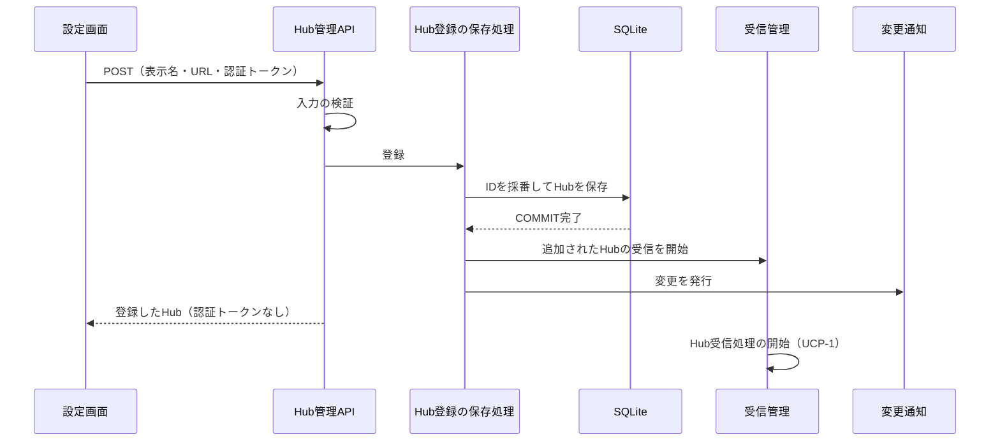

# UCP-4. 画面から登録したHubをDBへ保存し、受信へ反映する

適用条件と関与コンテナは [アーキテクチャの一覧](../architecture.md#patterns) を参照します。図は主成功系列を役割名で示し、UC 固有の逸脱は本書へ記録します。受信と保存は [UCP-1](UCP-1.md)、保存確定の通知と取得し直しは [UCP-3](UCP-3.md) をそのまま使います。実装パスは実装フェーズで記録します。

| 役割 | 責務 | 実装パス |
| --- | --- | --- |
| 設定画面 | `/settings` で登録済みHubの一覧と追加フォームを表示する。Add hub を押したときに入力を検証し、該当した項目のそばにメッセージを示す。認証トークンは送信後に画面へ戻さない | 実装フェーズで記録 |
| Hub管理API | Hub一覧の取得と追加を受け付ける。Hostヘッダーをループバックの名前に限定する。入力を設定画面と同じ規則で再検証し、不正な入力は保存せず項目ごとの理由を返す。応答に認証トークンを含めない | 実装フェーズで記録 |
| Hub登録の保存処理 | IDを採番して表示名・URL・認証トークンを `hubs` へ保存する。保存の COMMIT 完了後に受信管理へ追加を伝え、変更を発行する | 実装フェーズで記録 |
| 受信管理 | 起動時にDBの全Hubへ、追加の通知を受けたときは追加されたHubへ、Hub受信処理を開始する。Hubごとの受信は独立して動く | 実装フェーズで記録 |

- 整合性: 状態更新の主体はHub登録の保存処理 / 結果確定点は COMMIT 完了 / 障害時の停止・継続は、保存に失敗したときは受信を変えずに失敗を返し、受信の開始に失敗しても当該Hubだけを再接続の対象とし、他のHubとWebサーバーを維持する / 境界は、COMMIT 前に受信を開始しないことと、認証トークンを応答・ログ・通知に出さないこと。
- モックに置き換える境界と合成点: モック確認では画面側のHub管理APIを呼ぶ関数1箇所を合成点とし、登録済みのHubの固定表と、追加の成功を返す。実装フェーズで固定データを削除する。検証では外部のHubを制御可能なSSEサーバーに置き換え、追加のURLをそこへ向けて、本番の保存・受信処理を通す。

## 保存と変換の規則

- 保存先は `hubs` で、IDの採番に加えて URL と認証トークンの列が必要です。テーブル設計フェーズで [テーブル設計](data.dbml) へ追加し、版を上げる移行を定めます。
- 起動時は `hubs` の全行を受信の対象とします。接続設定ファイルは読まず、`HUB_CONFIG_PATH` は廃止します。登録済みのHubが0件でも起動します。
- 認証トークンはDBの値を除き、API応答・画面・ログ・通知に出しません。
