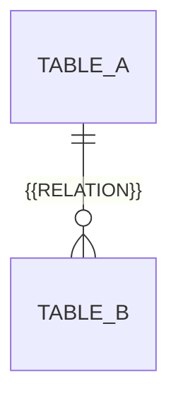

# データ設計

保存形式と現在のテーブル設計の正本です。DBを使う場合は以下にER図とテーブル定義を記載し、使わない場合はその旨と実際の保存形式を記し、不要な記入欄を削除します。変更範囲と論点は [設計標準](../standards/design-and-documentation.md#architecture-method) に従って会話で提示します。

| テーブル | 責務 | カラム（型 / NULL可否） | 主キー・外部キー・一意制約 |
| --- | --- | --- | --- |
| {{TABLE}} | {{RESPONSIBILITY}} | {{COLUMN}} / {{TYPE}} / {{NULLABLE}} | {{CONSTRAINTS}} |
