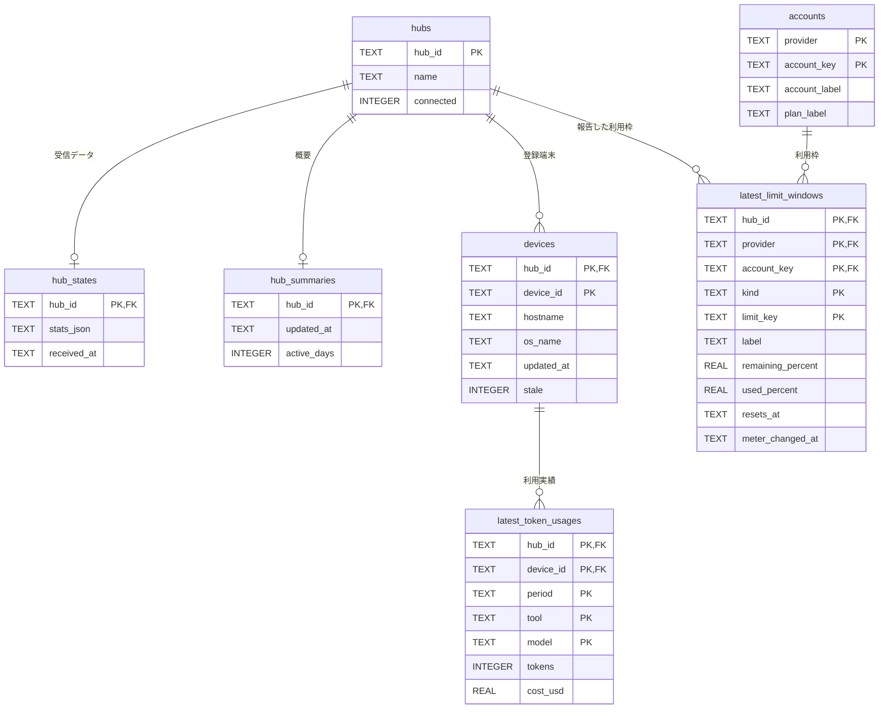

# データ設計

保存形式と現在のテーブル設計の正本です。変更範囲と論点は [設計標準](../standards/design-and-documentation.md#architecture-method) に従って会話で提示します。

Hubから受信したstats全体は受信データとして `hub_states` にそのまま保存し、同じトランザクションで本システムのドメインモデル（Hub・端末・トークン利用実績・アカウント・利用枠）へ変換して保存します。閲覧はドメインモデルのテーブルだけを読み、受信データの形式に依存しません。

## テーブル定義

### hubs

情報の提供元であるHub。状態を受信する前から存在する。

| カラム | 型 | NULL | キー | 説明 |
| --- | --- | --- | --- | --- |
| hub_id | TEXT | 不可 | PK | 設定で指定する安定した識別子 |
| name | TEXT | 不可 |  | 設定から登録する表示名。一意制約は設けない |
| connected | INTEGER | 不可 |  | 受信状態が「受信中」なら1、「再接続中」なら0 |

### hub_states

受信データ。snapshot・stats・freshness を反映した stats 全体をHubごとに0件または1件保持する。

| カラム | 型 | NULL | キー | 説明 |
| --- | --- | --- | --- | --- |
| hub_id | TEXT | 不可 | PK、FK → hubs.hub_id | 受信元のHub |
| stats_json | TEXT | 不可 |  | stats 全体のJSON |
| received_at | TEXT | 不可 |  | 最後に保存に成功した通知のローカル受信時刻。UTC の ISO 8601 |

### hub_summaries

Hub単位の概要。

| カラム | 型 | NULL | キー | 説明 |
| --- | --- | --- | --- | --- |
| hub_id | TEXT | 不可 | PK、FK → hubs.hub_id | 対象のHub |
| updated_at | TEXT | 不可 |  | Hubがデータを更新した時刻 |
| active_days | INTEGER | 可 |  | Hubが集計したアクティブ日数。Hubが送らない場合はNULL |

### devices

Hubに利用状況を送っている端末。

| カラム | 型 | NULL | キー | 説明 |
| --- | --- | --- | --- | --- |
| hub_id | TEXT | 不可 | PK、FK → hubs.hub_id | 端末が属するHub |
| device_id | TEXT | 不可 | PK | Hub内の端末識別子 |
| hostname | TEXT | 不可 |  | ホスト名 |
| os_name | TEXT | 可 |  | OS名 |
| updated_at | TEXT | 不可 |  | 端末が最後に送信した時刻 |
| stale | INTEGER | 不可 |  | Hubが鮮度切れと判定した場合は1、それ以外は0 |

### latest_token_usages

端末・期間・ツール・モデルごとのトークン利用実績。

| カラム | 型 | NULL | キー | 説明 |
| --- | --- | --- | --- | --- |
| hub_id | TEXT | 不可 | PK、FK → devices | 端末が属するHub |
| device_id | TEXT | 不可 | PK、FK → devices | 利用した端末 |
| period | TEXT | 不可 | PK | `today`・`month`・`all_time` |
| tool | TEXT | 不可 | PK | ツール識別子 |
| model | TEXT | 不可 | PK | モデル識別子 |
| tokens | INTEGER | 不可 |  | トークン数 |
| cost_usd | REAL | 可 |  | 推定コスト（USD）。Hubが送らない場合はNULL |

### accounts

AIツールの利用アカウント。複数のHub・端末から同じアカウントが報告される。

| カラム | 型 | NULL | キー | 説明 |
| --- | --- | --- | --- | --- |
| provider | TEXT | 不可 | PK | 提供元のサービス |
| account_key | TEXT | 不可 | PK | Hubが付与するハッシュ化されたアカウント識別子 |
| account_label | TEXT | 可 |  | アカウントの表示ラベル |
| plan_label | TEXT | 可 |  | 契約プランの表示ラベル |

### latest_limit_windows

Hubが報告したアカウントの利用枠。メーターを表示する枠だけを保持する。

| カラム | 型 | NULL | キー | 説明 |
| --- | --- | --- | --- | --- |
| hub_id | TEXT | 不可 | PK、FK → hubs.hub_id | 報告したHub |
| provider | TEXT | 不可 | PK、FK → accounts | アカウントの提供元 |
| account_key | TEXT | 不可 | PK、FK → accounts | アカウント識別子 |
| kind | TEXT | 不可 | PK | `session`・`daily`・`weekly`・`billing` などのリセット周期 |
| limit_key | TEXT | 不可 | PK | 枠の識別子。無い場合は枠の表示名 |
| label | TEXT | 可 |  | 枠の表示名 |
| remaining_percent | REAL | 不可 |  | 残量（%） |
| used_percent | REAL | 可 |  | 使用量（%） |
| resets_at | TEXT | 可 |  | 次のリセット時刻 |
| meter_changed_at | TEXT | 不可 |  | remaining_percent・used_percent が最後に変わった保存時刻 |

## 保存と変換の規則

- 起動時に、設定にある全Hubの ID と表示名を登録し、`connected` を1にします。同じ ID は表示名と `connected` を更新します。設定にないHubは同じトランザクションで `hubs` の行を削除し、`hub_states`・`hub_summaries`・`devices`・`latest_token_usages`・`latest_limit_windows` の行は連鎖削除で消します。続けて、どの `latest_limit_windows` からも参照されない `accounts` の行を削除します。
- 受信が止まったHubは `connected` を0にします。再接続後の保存で、受信データと同じトランザクションで1に戻します。起動直後の最初の接続中も1です。
- `snapshot` と `stats` は `hub_states` を全体置換し、`freshness` は既存の stats に時刻・鮮度情報だけを適用して書き戻します。どちらの場合も、同じトランザクションで当該Hubの `hub_summaries`・`devices`・`latest_token_usages`・`latest_limit_windows` を新しい stats から作り直します。`accounts` は報告された行を登録し、ラベルを最新の値で更新します。
- `latest_token_usages` は端末ごとの期間別 `clientModels`・`clientModelCosts` から作ります。Hub・ツール・モデル単位の合計はこのテーブルの合計で求めます（2026-09-12取得の実測資料で、期限切れの端末がない場合にHub集約の各合計と端末別・ツール×モデル別の合計が一致することを確認）。period は stats の `periods.today`・`month`・`allTime` に対応します。端末の `today`・`month` は、`periodWindows` の当該期間の `endsAt` が受信時刻以前なら期限切れとして行を作りません。`periodWindows` が無い端末は、端末の最終更新時刻と受信時刻のUTCの日付・月が異なる場合に期限切れとします（Hubが自身の集計から期限切れの端末分を除く規則と同じ）。
- `latest_limit_windows` は Hub集約の `limits.providers` のうち、`showMeter` が真で `remainingPercent` が数値の枠から作ります。同じアカウントの同じ枠を複数のHubが報告した場合は Hub ごとに行を持ち、閲覧ではHubを選んで表示します。`meter_changed_at` は作り直す前の行と残量が同じなら引き継ぎ、変わった場合と新規の場合は今回の受信時刻にします。
- URLと認証トークンは保存しません。セッション、プロジェクト、日次・月次履歴、トークンの内訳（キャッシュ・出力など）、アカウントのメールアドレス・氏名はドメインモデルに含めません（受信データには含まれます）。
- `hubs` と `devices` を参照する外部キーは連鎖削除を設け、`accounts` を参照する外部キーには設けません。連鎖更新は設けません。スキーマ版0から1への移行で全テーブルを作成し、作成と版の更新は同一トランザクションで行います。
