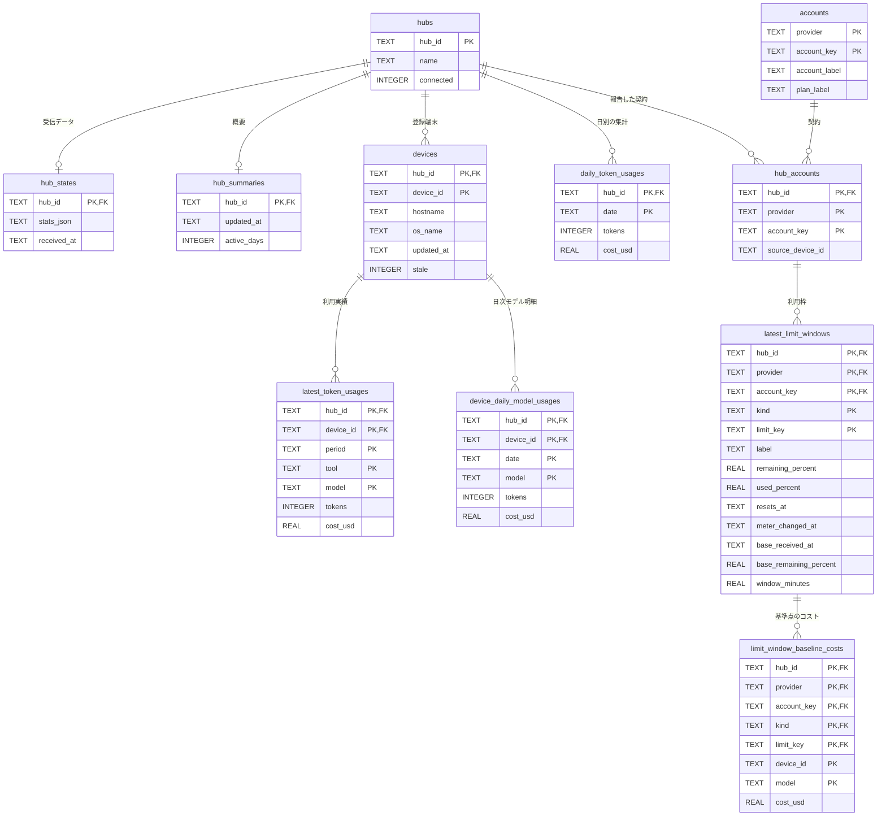

# データ設計

保存形式と現在のテーブル設計の正本です。変更範囲と論点は [設計標準](../standards/design-and-documentation.md#architecture-method) に従って会話で提示します。

Hubから受信したstats全体は受信データとして `hub_states` にそのまま保存し、同じトランザクションで本システムのドメインモデル（Hub・端末・トークン利用実績・日別の集計・端末別の日次モデル明細・アカウント・利用枠）へ変換して保存します。閲覧はドメインモデルのテーブルだけを読み、受信データの形式に依存しません。

```mermaid
erDiagram
  hubs ||--o| hub_states : "受信データ"
  hubs ||--o| hub_summaries : "概要"
  hubs ||--o{ devices : "登録端末"
  hubs ||--o{ daily_token_usages : "日別の集計"
  devices ||--o{ latest_token_usages : "利用実績"
  hubs ||--o{ hub_accounts : "報告した契約"
  accounts ||--o{ hub_accounts : "契約"
  hub_accounts ||--o{ latest_limit_windows : "利用枠"
  latest_limit_windows ||--o{ limit_window_baseline_costs : "基準点のコスト"
  devices ||--o{ device_daily_model_usages : "日次モデル明細"
  hubs {
    TEXT hub_id PK
    TEXT name
    INTEGER connected
  }
  hub_states {
    TEXT hub_id PK,FK
    TEXT stats_json
    TEXT received_at
  }
  hub_summaries {
    TEXT hub_id PK,FK
    TEXT updated_at
    INTEGER active_days
  }
  daily_token_usages {
    TEXT hub_id PK,FK
    TEXT date PK
    INTEGER tokens
    REAL cost_usd
  }
  devices {
    TEXT hub_id PK,FK
    TEXT device_id PK
    TEXT hostname
    TEXT os_name
    TEXT updated_at
    INTEGER stale
  }
  latest_token_usages {
    TEXT hub_id PK,FK
    TEXT device_id PK,FK
    TEXT period PK
    TEXT tool PK
    TEXT model PK
    INTEGER tokens
    REAL cost_usd
  }
  device_daily_model_usages {
    TEXT hub_id PK,FK
    TEXT device_id PK,FK
    TEXT date PK
    TEXT model PK
    INTEGER tokens
    REAL cost_usd
  }
  accounts {
    TEXT provider PK
    TEXT account_key PK
    TEXT account_label
    TEXT plan_label
  }
  hub_accounts {
    TEXT hub_id PK,FK
    TEXT provider PK
    TEXT account_key PK
    TEXT source_device_id
  }
  latest_limit_windows {
    TEXT hub_id PK,FK
    TEXT provider PK,FK
    TEXT account_key PK,FK
    TEXT kind PK
    TEXT limit_key PK
    TEXT label
    REAL remaining_percent
    REAL used_percent
    TEXT resets_at
    TEXT meter_changed_at
    TEXT base_received_at
    REAL base_remaining_percent
    REAL window_minutes
  }
  limit_window_baseline_costs {
    TEXT hub_id PK,FK
    TEXT provider PK,FK
    TEXT account_key PK,FK
    TEXT kind PK,FK
    TEXT limit_key PK,FK
    TEXT device_id PK
    TEXT model PK
    REAL cost_usd
  }
```

## テーブル定義

### hubs

情報の提供元であるHub。状態を受信する前から存在する。

| カラム | 型 | NULL | キー | 説明 |
| --- | --- | --- | --- | --- |
| hub_id | TEXT | 不可 | PK | 設定で指定する安定した識別子 |
| name | TEXT | 不可 |  | 設定から登録する表示名。一意制約は設けない |
| connected | INTEGER | 不可 |  | 受信状態が「受信中」なら1、「再接続中」なら0 |

### hub_states

受信データ。最後に受けた snapshot・stats の stats 全体をHubごとに0件または1件保持する。freshness は反映しない。

| カラム | 型 | NULL | キー | 説明 |
| --- | --- | --- | --- | --- |
| hub_id | TEXT | 不可 | PK、FK → hubs.hub_id | 受信元のHub |
| stats_json | TEXT | 不可 |  | stats 全体のJSON |
| received_at | TEXT | 不可 |  | 最後に保存に成功した通知のローカル受信時刻。UTC の ISO 8601 |

### hub_summaries

Hub単位の概要。

| カラム | 型 | NULL | キー | 説明 |
| --- | --- | --- | --- | --- |
| hub_id | TEXT | 不可 | PK、FK → hubs.hub_id | 対象のHub |
| updated_at | TEXT | 不可 |  | Hubがデータを更新した時刻 |
| active_days | INTEGER | 可 |  | Hubが集計したアクティブ日数。Hubが送らない場合はNULL |

### devices

Hubに利用状況を送っている端末。

| カラム | 型 | NULL | キー | 説明 |
| --- | --- | --- | --- | --- |
| hub_id | TEXT | 不可 | PK、FK → hubs.hub_id | 端末が属するHub |
| device_id | TEXT | 不可 | PK | Hub内の端末識別子 |
| hostname | TEXT | 不可 |  | ホスト名 |
| os_name | TEXT | 可 |  | OS名 |
| updated_at | TEXT | 不可 |  | 端末が最後に送信した時刻 |
| stale | INTEGER | 不可 |  | Hubが鮮度切れと判定した場合は1、それ以外は0 |

### latest_token_usages

端末・期間・ツール・モデルごとのトークン利用実績。

| カラム | 型 | NULL | キー | 説明 |
| --- | --- | --- | --- | --- |
| hub_id | TEXT | 不可 | PK、FK → devices | 端末が属するHub |
| device_id | TEXT | 不可 | PK、FK → devices | 利用した端末 |
| period | TEXT | 不可 | PK | `today`・`month`・`all_time` |
| tool | TEXT | 不可 | PK | ツール識別子 |
| model | TEXT | 不可 | PK | モデル識別子 |
| tokens | INTEGER | 不可 |  | トークン数 |
| cost_usd | REAL | 可 |  | 推定コスト（USD）。Hubが送らない場合はNULL |

### daily_token_usages

Hubが送った日別のトークン利用実績。Hubごとに、日付1つにつき1行を持つ。受信のたびに、受け取った日付だけを上書きまたは追加し、他の日付の行は消さない。

| カラム | 型 | NULL | キー | 説明 |
| --- | --- | --- | --- | --- |
| hub_id | TEXT | 不可 | PK、FK → hubs.hub_id | 日別の集計を送ったHub |
| date | TEXT | 不可 | PK | Hubが送る日付（`YYYY-MM-DD`）。時刻帯の変換はしない |
| tokens | INTEGER | 不可 |  | その日の合計トークン数 |
| cost_usd | REAL | 可 |  | その日の推定コスト（USD）。Hubが送らない場合はNULL |

### device_daily_model_usages

Hub・端末・日付・モデルごとの利用実績。同じモデル名はツール間で合算する。全カラムを次の定義とし、`STRICT` テーブルとする。

| カラム | 型 | NULL | キー | 説明 |
| --- | --- | --- | --- | --- |
| hub_id | TEXT | 不可 | PK、FK → devices | 端末が属するHub |
| device_id | TEXT | 不可 | PK、FK → devices | 利用した端末 |
| date | TEXT | 不可 | PK | 端末が報告した日付（`YYYY-MM-DD`）。時刻帯の変換はしない |
| model | TEXT | 不可 | PK | モデル名 |
| tokens | INTEGER | 不可 |  | その日のトークン数 |
| cost_usd | REAL | 可 |  | その日の推定コスト（USD）。不明ならNULL |

主キーは `(hub_id, device_id, date, model)`、外部キーは `(hub_id, device_id)` から `devices(hub_id, device_id)` への複合外部キーで、`ON DELETE CASCADE` を指定する。その他の一意制約と履歴取得可否のカラムは設けない。明細の有無は保存済みの行から判断する。

### accounts

AIツールの利用アカウント。複数のHub・端末から同じアカウントが報告される。

| カラム | 型 | NULL | キー | 説明 |
| --- | --- | --- | --- | --- |
| provider | TEXT | 不可 | PK | 提供元のサービス |
| account_key | TEXT | 不可 | PK | Hubが付与するハッシュ化されたアカウント識別子 |
| account_label | TEXT | 可 |  | アカウントの表示ラベル |
| plan_label | TEXT | 可 |  | 契約プランの表示ラベル |

### hub_accounts

Hubが利用枠を報告した契約（Hub×アカウント）。メーターを表示する枠を1つ以上報告した契約だけを保持する。

| カラム | 型 | NULL | キー | 説明 |
| --- | --- | --- | --- | --- |
| hub_id | TEXT | 不可 | PK、FK → hubs.hub_id | 報告したHub |
| provider | TEXT | 不可 | PK、FK → accounts | アカウントの提供元 |
| account_key | TEXT | 不可 | PK、FK → accounts | アカウント識別子 |
| source_device_id | TEXT | 可 |  | Hubが報告した、アカウントの利用枠を取得した端末（`sourceDeviceId`）。`devices.device_id` への論理参照で、外部キーは設けない。Hubが送らない場合はNULL |

### latest_limit_windows

Hubが報告した契約の利用枠。メーターを表示する枠だけを保持する。推定上限額の2つの計測点のうち、1つ目の残量を `base_` のカラムに、2つ目（最新の受信）を `remaining_percent` に持つ。コストは保存せず、1つ目の計測点のコストは `limit_window_baseline_costs`、2つ目のコストは `latest_token_usages` から求める。

| カラム | 型 | NULL | キー | 説明 |
| --- | --- | --- | --- | --- |
| hub_id | TEXT | 不可 | PK、FK → hub_accounts | 報告したHub |
| provider | TEXT | 不可 | PK、FK → hub_accounts | アカウントの提供元 |
| account_key | TEXT | 不可 | PK、FK → hub_accounts | アカウント識別子 |
| kind | TEXT | 不可 | PK | `session`・`daily`・`weekly`・`billing` などのリセット周期 |
| limit_key | TEXT | 不可 | PK | 枠の識別子。無い場合は枠の表示名 |
| label | TEXT | 可 |  | 枠の表示名 |
| remaining_percent | REAL | 不可 |  | 残量（%） |
| used_percent | REAL | 可 |  | 使用量（%） |
| resets_at | TEXT | 可 |  | 次のリセット時刻 |
| meter_changed_at | TEXT | 不可 |  | remaining_percent・used_percent が最後に変わった保存時刻 |
| base_received_at | TEXT | 不可 |  | 1つ目の計測点の受信時刻 |
| base_remaining_percent | REAL | 不可 |  | 1つ目の計測点の残量（%）。枠の単位で1つ報告される値なので、端末・モデルには分けない |
| window_minutes | REAL | 可 |  | Hubが報告した枠の長さ（分）。Hubが送らない枠はNULL。画面は、NULLの枠の長さを `kind` の固定表で補う |

### limit_window_baseline_costs

枠の1つ目の計測点を取った時点の、端末×モデル別の累計推定コスト。枠の提供元と同じツールの累計（allTime）で、推定コストのある実績だけを保持する。枠のコストの範囲は問わず、事実だけを保存する（範囲は閲覧時に [UCP-1](UCP-1.md) の純粋関数が適用する）。

| カラム | 型 | NULL | キー | 説明 |
| --- | --- | --- | --- | --- |
| hub_id | TEXT | 不可 | PK、FK → latest_limit_windows | 枠を報告したHub |
| provider | TEXT | 不可 | PK、FK → latest_limit_windows | 枠の提供元 |
| account_key | TEXT | 不可 | PK、FK → latest_limit_windows | アカウント識別子 |
| kind | TEXT | 不可 | PK、FK → latest_limit_windows | 枠のリセット周期 |
| limit_key | TEXT | 不可 | PK、FK → latest_limit_windows | 枠の識別子 |
| device_id | TEXT | 不可 | PK | 利用した端末。`devices.device_id` への論理参照で、外部キーは設けない（端末の行は受信のたびに作り直すため） |
| model | TEXT | 不可 | PK | モデル識別子 |
| cost_usd | REAL | 不可 |  | 1つ目の計測点での累計推定コスト（USD） |

## 保存と変換の規則

- 起動時に、設定にある全Hubの ID と表示名を登録し、`connected` を1にします。同じ ID は表示名と `connected` を更新します。設定にないHubは同じトランザクションで `hubs` の行を削除し、`hub_states`・`hub_summaries`・`devices`・`latest_token_usages`・`daily_token_usages`・`device_daily_model_usages`・`hub_accounts` の行は連鎖削除で消え、続けて `latest_limit_windows`・`limit_window_baseline_costs` の行も連鎖して消えます。続けて、どの `hub_accounts` からも参照されない `accounts` の行を削除します。
- 受信が止まったHubは `connected` を0にします。再接続後の保存で、受信データと同じトランザクションで1に戻します。起動直後の最初の接続中も1です。
- `snapshot` と `stats` は `hub_states` を全体置換し、同じトランザクションで当該Hubの `hub_summaries`・`latest_token_usages` を新しい stats から作り直し、`hub_accounts`・`latest_limit_windows` は新しい stats の内容で更新します（行は作り直さず upsert し、報告されなくなった行だけを削除します。基準点のコストを消さないためです）。`devices` は報告された端末を追加または更新し、報告から消えた端末だけを削除します。端末をすべて消してから作り直す処理は行わず、残った端末の日次明細を維持します。`accounts` は報告された行を登録し、ラベルを最新の値で更新します。
- 端末の日次モデル明細は同期側が `GET /api/devices` から取得します。`snapshot` 受信時はrevisionの報告有無にかかわらず取得し、`stats` では報告された `deviceHistoryRevision` が変わった場合だけ取得します。同じrevisionのstatsと `freshness` では再取得しません。revisionを報告しないstatsは日次明細を更新しません。取得を完了してから、通知のstatsと日次明細を同じトランザクションで保存します。取得・検証・保存の失敗時は以前の保存値を維持し、当該Hubだけを再接続します。閲覧側への通知はCOMMIT完了後だけ発行します。
- `device_daily_model_usages` は受け取った端末・日付の組だけモデル明細を置き換え、受け取っていない日付は維持します。当日の最新値は、端末が報告した `periodWindows.today.key` の日付があり、当日の期間が受信時刻で期限内かつ最新の当日トークン合計が同日の履歴合計以上の場合に、その端末・日付のモデル明細を置き換えます。revisionを報告するstatsでは、同じrevisionでも保存済み履歴のある端末にこの規則を適用し、当日の最新値と保存済みの当日トークン合計を比較します。この更新のために再取得・取得状態フラグ・履歴のキャッシュは設けません。最新値と履歴を加算しません。
- `freshness` は保存済みの行を読まず、同じトランザクションで `hub_states.received_at`、`hub_summaries.updated_at`、通知に含まれる端末の `devices.updated_at`・`stale` だけを更新します。`hub_states.stats_json` と日次明細を含むその他の利用量は変更しません。期間の区切りが変わるとHubは `stats` を送るため、期限切れの判定は `snapshot`・`stats` の保存時だけ行います。
- `latest_token_usages` は端末ごとの期間別 `clientModels`・`clientModelCosts` から作ります。Hub・ツール・モデル単位の合計はこのテーブルの合計で求めます（2026-09-12取得の実測資料で、期限切れの端末がない場合にHub集約の各合計と端末別・ツール×モデル別の合計が一致することを確認）。period は stats の `periods.today`・`month`・`allTime` に対応します。端末の `today`・`month` は、`periodWindows` の当該期間の `endsAt` が受信時刻以前なら期限切れとして行を作りません。`periodWindows` が無い端末は、端末の最終更新時刻と受信時刻のUTCの日付・月が異なる場合に期限切れとします（Hubが自身の集計から期限切れの端末分を除く規則と同じ）。
- `hub_accounts` は Hub集約の `limits.providers` のうち、メーターを表示する枠を1つ以上持つ契約から作ります。`source_device_id` は、その提供元の項目の `sourceDeviceId`（無ければNULL）をそのまま保存します。
- `latest_limit_windows` は Hub集約の `limits.providers` のうち、`showMeter` が真で `remainingPercent` が数値の枠から作ります。同じアカウントの同じ枠を複数のHubが報告した場合は Hub ごとに行を持ち、閲覧ではHubを選んで表示します。`window_minutes` は枠の `windowMinutes`（数値。無ければNULL）をそのまま保存します。`meter_changed_at` は更新前の行と残量が同じなら引き継ぎ、変わった場合と新規の場合は今回の受信時刻にします。
- `latest_limit_windows` の1つ目の計測点は、更新前の行があり、受信時刻が更新前の行の `resets_at` より前（`resets_at` が無ければ条件なし）で、残量が前回以下なら引き継ぎます。`resets_at` の値は受信のたびに変わりうるため、値の一致では判定しません。新規の枠、受信時刻が更新前の行の `resets_at` を過ぎた場合、残量が増えた（使用率が減った）場合は、今回の受信時刻・残量を1つ目の計測点にし、同じトランザクションで、その枠の `limit_window_baseline_costs` を消して、今回の `latest_token_usages` の累計（allTime）のうち、枠の提供元と同じツールで推定コストのある端末×モデルの行から作り直します。
- 閲覧では、枠のコストの範囲の決定と推定上限額を、[UCP-1](UCP-1.md) の純粋関数で求めます。入力は、同じHub・同じ提供元の `hub_accounts`・`latest_limit_windows`、現在の `latest_token_usages`（allTime）と、各枠の `limit_window_baseline_costs` です。コストの増分は、範囲に入る端末×モデルごとの「現在のコスト − 1つ目の計測点のコスト」の合計で、組ごとの増分は0を下限とし、1つ目の計測点にない組は0として扱います。推定上限額は `コストの増分 ÷ (base_remaining_percent − remaining_percent) × 100` で、残量の差が1ポイント未満か、コストの増分が0以下なら「推定中」（Estimating）、範囲を確定できなければ「N/A」とします。
- URLと認証トークンは保存しません。セッション、プロジェクト、月次履歴、トークンの内訳（キャッシュ・出力など）、アカウントのメールアドレス・氏名はドメインモデルに含めません（受信データには含まれます）。
- `hubs` を参照する外部キー、`hub_accounts` を参照する外部キー、`latest_limit_windows` を参照する外部キーは連鎖削除を設けます。`devices` を参照する外部キー（`latest_token_usages`・`device_daily_model_usages`）は連鎖削除を設け、`accounts` を参照する外部キーには設けません。連鎖更新は設けません。スキーマ版0から1への移行で初期テーブルを作成し、版1から2への移行で `latest_limit_windows` を作り直します（既存の行は移さず、次の `snapshot`・`stats` で作り直します）。版2から3への移行で `latest_limit_windows` に `window_minutes` を追加します（既存の行はNULLのままで、次の `snapshot`・`stats` で値が入ります）。版3から4への移行で `daily_token_usages` を追加します。版4から5への移行で `device_daily_model_usages` を追加し、既存データは保持します。新しいテーブルは空の状態から始まり、同期の取り込みで行を作ります。版5から6への移行で `latest_limit_windows` を作り直し（`base_cost_usd`・`cost_usd` を持たず、外部キーを `hub_accounts` に付け替える。既存の行は移さない）、`hub_accounts` と `limit_window_baseline_costs` を作成します。次の `snapshot`・`stats` で、契約・枠・1つ目の計測点が作られます。移行と版の更新は同一トランザクションで行います。
