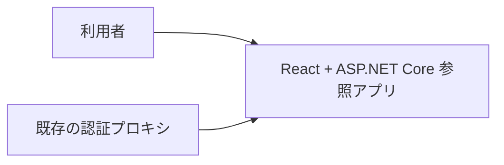
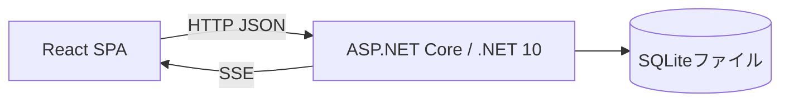

# アーキテクチャ

React + ASP.NET Core 参照アプリの全体構成、実現パターンの適用条件、設計上の制約を記録します。技術固有の構造は [React + .NET 補足](architecture-react-dotnet.md)、ユースケース仕様は [UC 一覧](project.md#usecases)、具体的なパターンとデータ設計は `design/` を参照します。

## 1. システムコンテキスト

## 2. コンテナ

| コンテナ | 技術 | 責務 | リポジトリ内パス |
| --- | --- | --- | --- |
| 画面 | React / TanStack / Mantine | ユースケースの対話 | `frontend/src` |
| サーバー | ASP.NET Core / .NET 10 | 認証境界、HTTP JSON、SSE、機能、結果確定、静的 UI 配信 | `backend` |
| 永続化 | SQLite / Microsoft.Data.Sqlite / Dapper | 所有者別データと制約 | `backend/Infrastructure/Persistence/`、`backend/Features/Notes/` |

UI→API のモック差し替え境界は、Vite の `@notes-access` 参照先です。実処理では HTTP JSON の公開エンドポイントへ接続します。C# の入出力型から OpenAPI と `contracts/api.gen.ts` を生成し、ブラウザは `contracts/notes.ts` の別名を通して利用します。生成結果の一致と HTTP 境界テストで契約を検証します。

## 3. 実現パターンの適用条件

| 設計 | 適用条件 | 関与コンテナ |
| --- | --- | --- |
| [UCP-1. 取得・編集・確定](design/UCP-1.md) | 取得データを下書きとして編集し、保存・削除する。 | 画面・サーバー・永続化 |
| [UCP-2. 入力・確認・一括確定](design/UCP-2.md) | 複数画面の対話で内容を確認後、関連更新を一体で確定する。 | 画面・サーバー・永続化 |

## 4. 設計上の制約

- 保存方式、テーブル、値の制約は [データ設計](design/data.md) に従います。
- React・ASP.NET Core の責務、状態更新、起動単位は [React + .NET 補足](architecture-react-dotnet.md) に従います。
- .NET・React の単体テスト、.NET の統合テスト、E2E の分担・分離条件は [テストの分担と並列実行](architecture-react-dotnet.md#test-boundary) に従います。
- 共有環境の認証境界は [配備・認証](architecture-react-dotnet.md#deployment) に従います。
