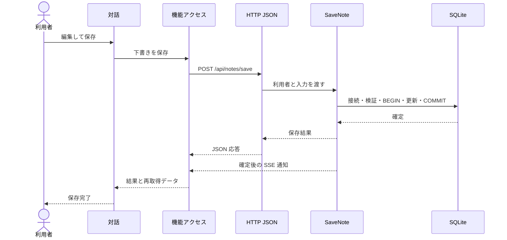

# UCP-1. 取得・編集・確定

関連: [アーキテクチャ](../architecture.md)、[ユースケース](../usecases/メモを作成・編集して保存する/README.md)、[データ設計](data.md)。

適用: 取得データを下書きとして編集し、保存・削除する。

| 役割 | 責務 | 実装パス |
| --- | --- | --- |
| 対話 | 入力、下書き、失敗時の再入力 | `frontend/src/usecases/edit-notes/EditNotes.tsx` |
| 機能アクセス | Query、mutation、変更通知の購読 | `frontend/src/features/notes/queries.ts` |
| 保存 API | HTTP 受付、入力検証、所有者条件、版検査、SQL 確定 | `backend/Features/Notes/SaveNote.cs` |
| HTTP 共通境界 | セッション、認証、SSE、公開エラーの検証 | `backend/Presentation/Http/ApiEndpoints.cs` |
| 一覧・単件取得 | 所有者条件と SQL 読み取り | `backend/Features/Notes/ListNotes.cs`、`GetNote.cs` |
| 削除 API | HTTP 受付、所有者条件、版検査、SQL 確定 | `backend/Features/Notes/RemoveNote.cs` |

保存の状態更新主体および結果確定点は `SaveNote` の COMMIT です。失敗時はトランザクションをロールバックして下書きを維持します。再取得や SSE の失敗で確定済み保存を失敗扱いに変更しません。

公開エラーはHTTPステータスとASP.NET Core標準のProblem Detailsで返し、入力検証はフィールド別の `errors` を含めます。モック境界と合成点は [アーキテクチャ](../architecture.md) の UI→API の定義に従います。「メモを作成・編集して保存する」固有の逸脱はありません。
