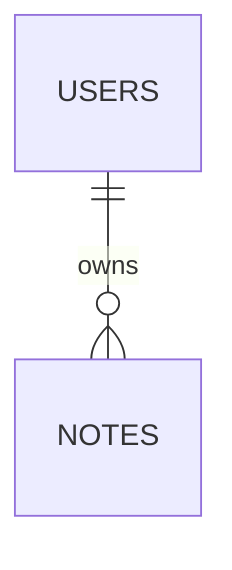

# データ設計

関連: [アーキテクチャ](../architecture.md)、[UCP-1](UCP-1.md)、[UCP-2](UCP-2.md)。

DB は `DB_PATH` で指定したサーバーの永続領域に配置し、本番・E2E とも同一マイグレーションを使用します。SQL 移行は `backend/Infrastructure/Persistence/Migrations` に置きます。`Microsoft.Data.Sqlite` で操作ごとに接続を開き、WAL、外部キー制約、有限の busy timeout を有効にします。トランザクションは外部 I/O や利用者の確認待ちを含まない短い処理で確定します。

| テーブル | カラム | 制約 |
| --- | --- | --- |
| users | id TEXT、name TEXT | id 主キー、全項目 NOT NULL |
| notes | id TEXT、owner_id TEXT、title TEXT、body TEXT、version INTEGER、updated_at TEXT | id 主キー、owner_id 外部キー、owner_id/title 一意、全項目 NOT NULL |

title は 1〜100 文字、body は 10,000 文字以内、version は正整数、日時は UTC ISO 文字列とします。これらは参照実装の仕様であり、製品へ暗黙に引き継ぎません。同一所有者の複数タブ編集を検証するため、notes は version による版検査を行います。
